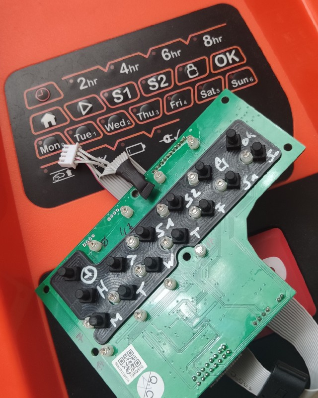
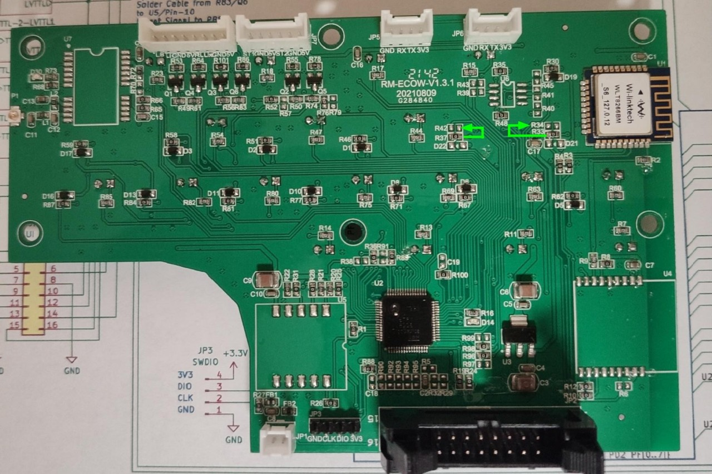
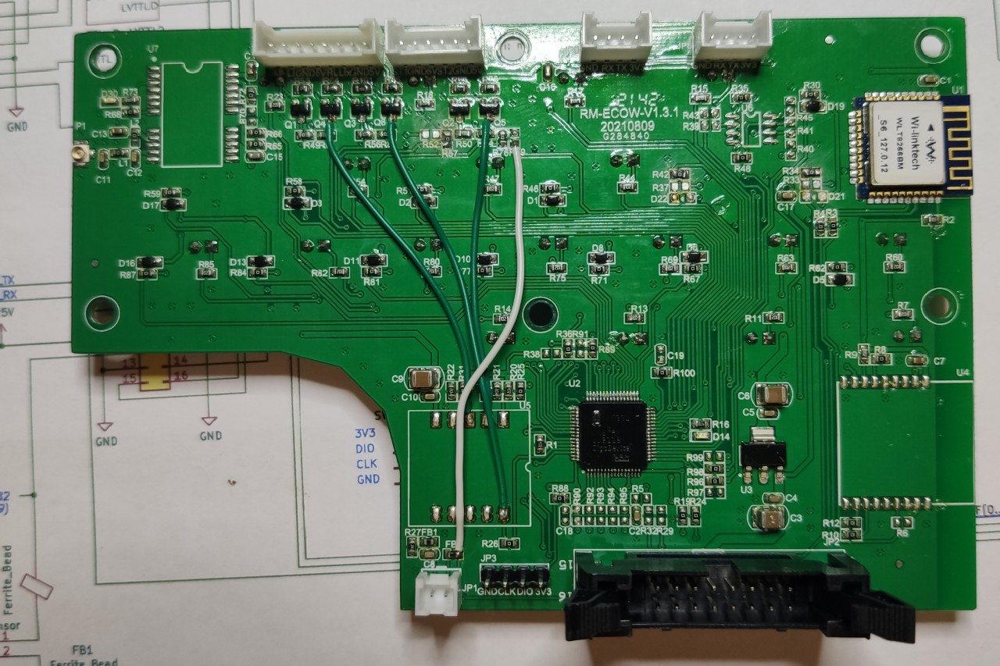
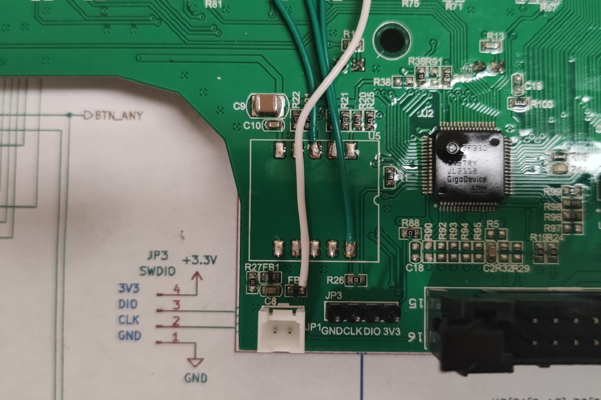
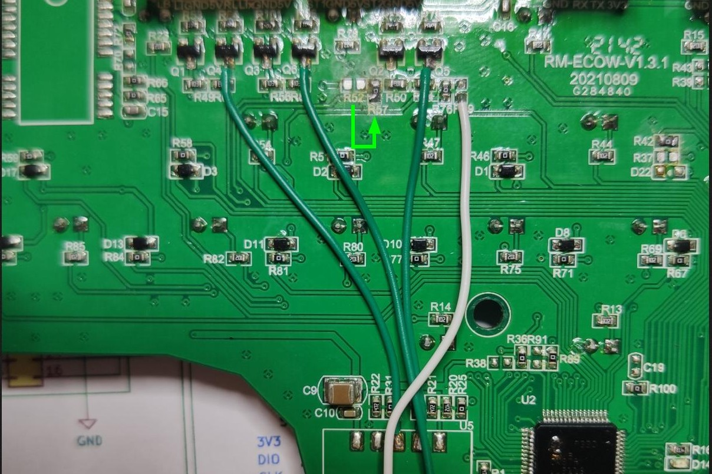
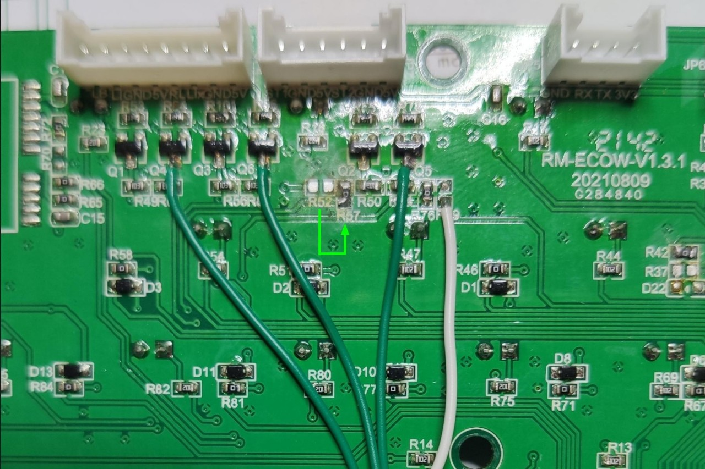
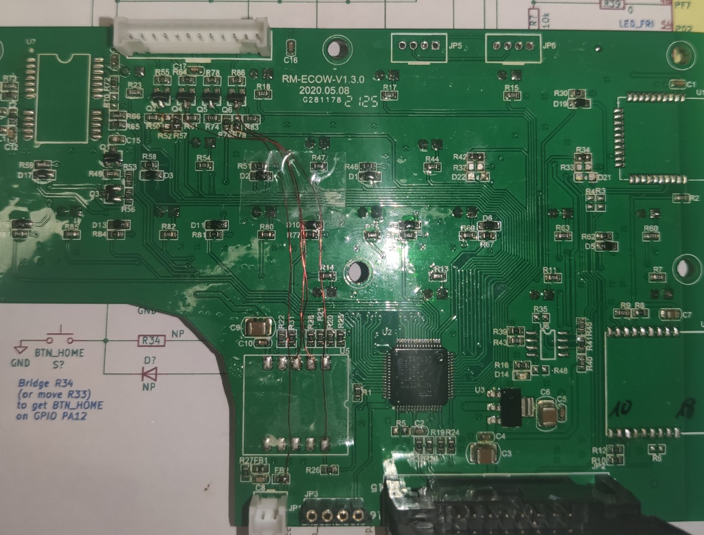

([back to README][README])

## YardForce Classic 500B, RM-ECOW-V1.3.1 MODs

### Buttons (*mandatory*)

With the stock component placement, Button-Home and Button-Play get routed to the main (black) 16 pin connector (JP2/J6).
But we need them routed to the MCU.
Luckily the PCB is already prepared for this.

Move the 0 Ohm (bridge) resistors:

1. R33 to the NonPlaced R34 position (Button-Home)
2. R37 to (NP) R42 (Button-Play)

You might also simply bridge R34 and R42, but for me it was simpler to move them

(<a href="#readme-top">back to top</a>)

### Rain Sensor (*optional*)

If you also like to use the Stock-Rain-Sensor cabling, you need to solder a separate cable from FB2 to the non-placed R79.
See the white cable on the following images:

(<a href="#readme-top">back to top</a>)

### Emergency Hall Sensors (*optional*)

If you also like to use your Stock-Hall-Sensor cabling (2 \* stop-button & 2 \* wheel-lift):

Then you need to solder one more R- bridge as well as 3 more separate cables.
Take into **attention** that you need to make all 4 steps:

1. Move R52 to (non-placed) R57 (see green arrow on image), or simple bridge R57 (i.e. with 32kg solder)
2. Solder a cable-bridge from Q4/R61 to U5/Pin3 (see left green cable)
3. Solder a cable-bridge from the bottom end of R76 to U5/Pin2 (see middle green cable)
4. Solder a cable-bridge from Q6/R83 to U5/Pin10 (see right green cable)

I only made it with colored cables for a more clear documentation.
If you've repair-wire like [this](https://de.farnell.com/roadrunner/rrp-a-105/draht-0-15mm-sortiert-pk-4/dp/5017233), it might look better, like this:

(<a href="#readme-top">back to top</a>)

([back to README][README])

[README]: README.md
