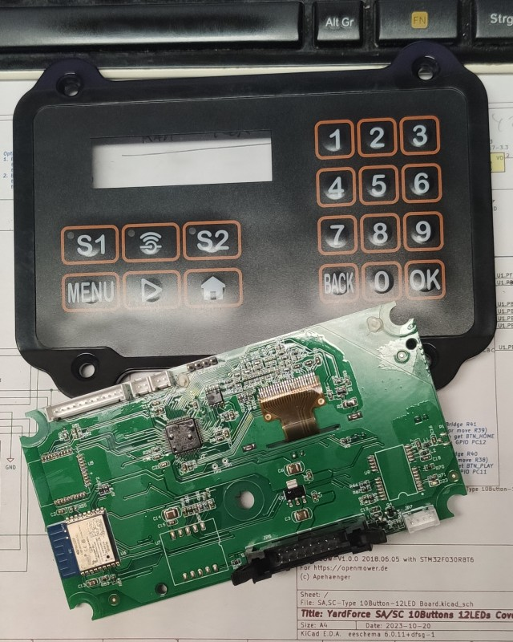
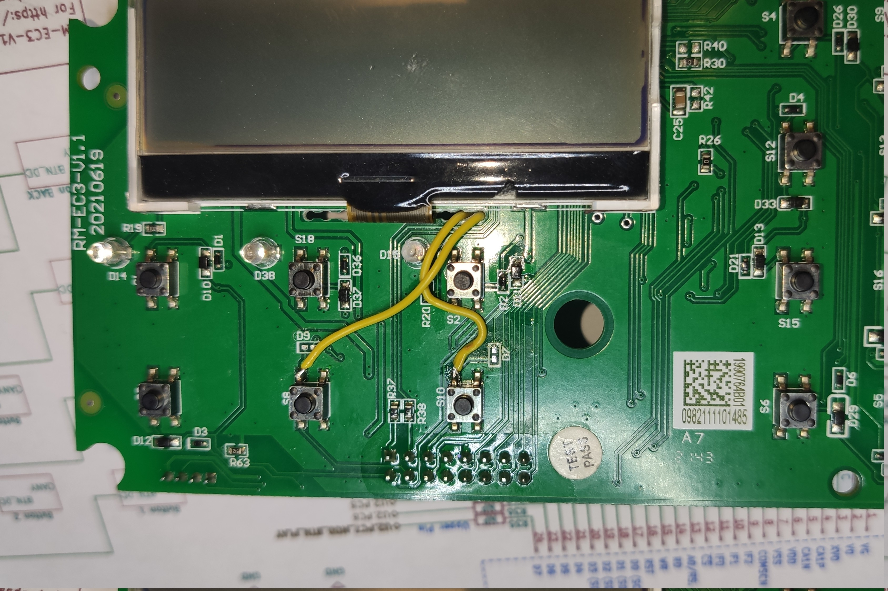
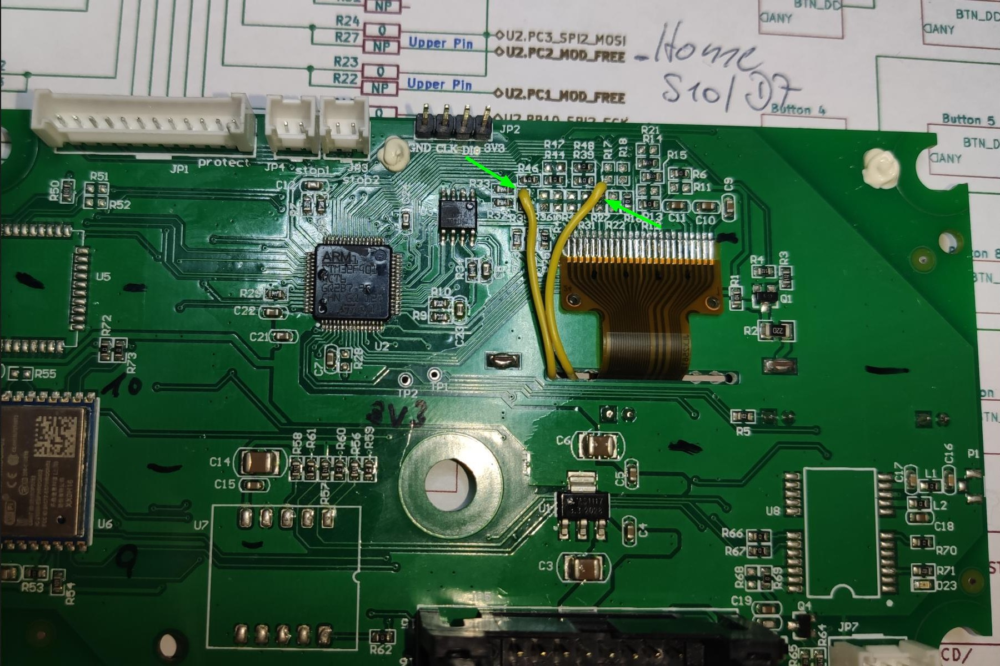
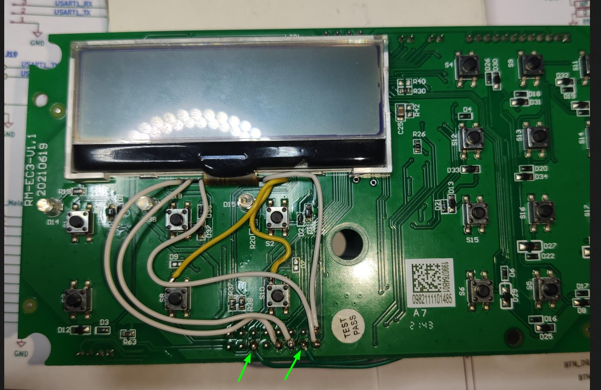
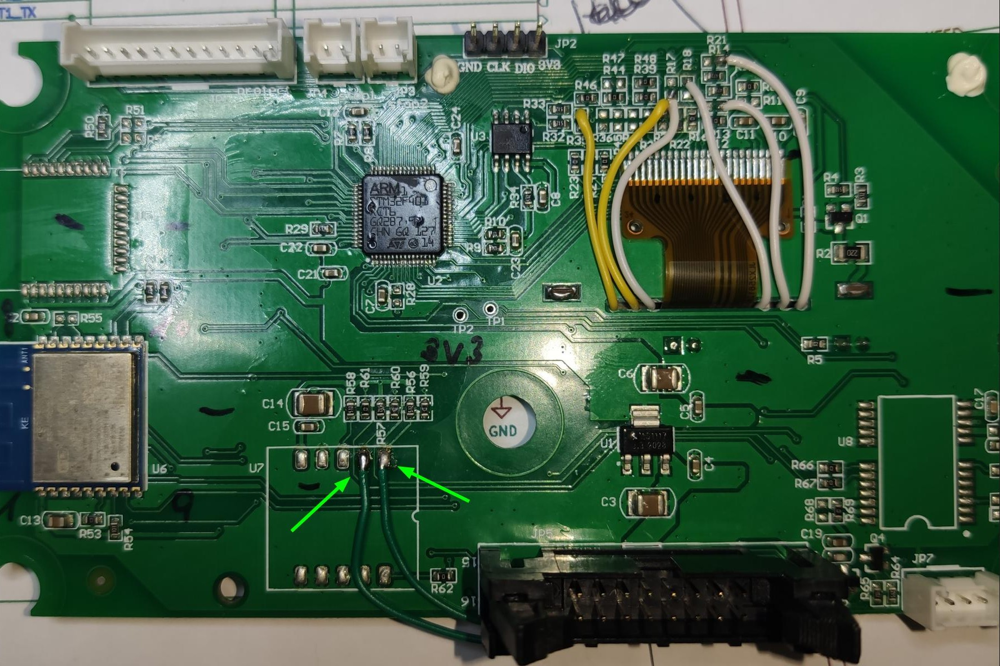
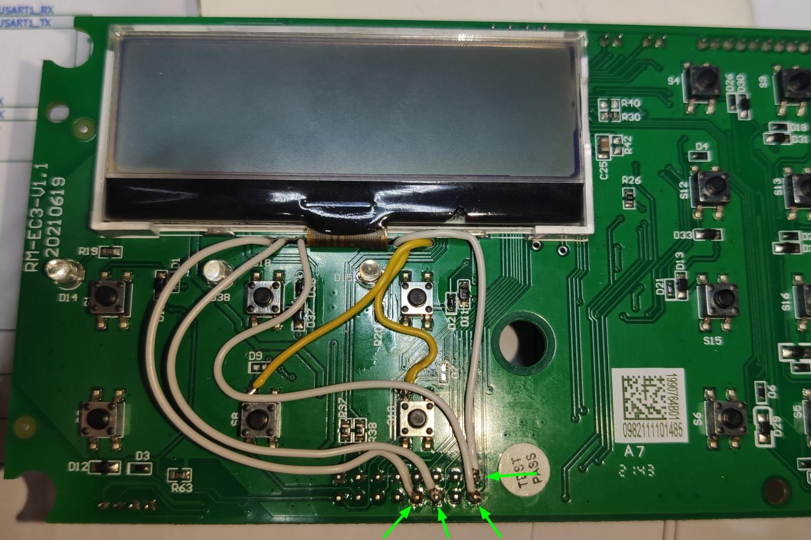
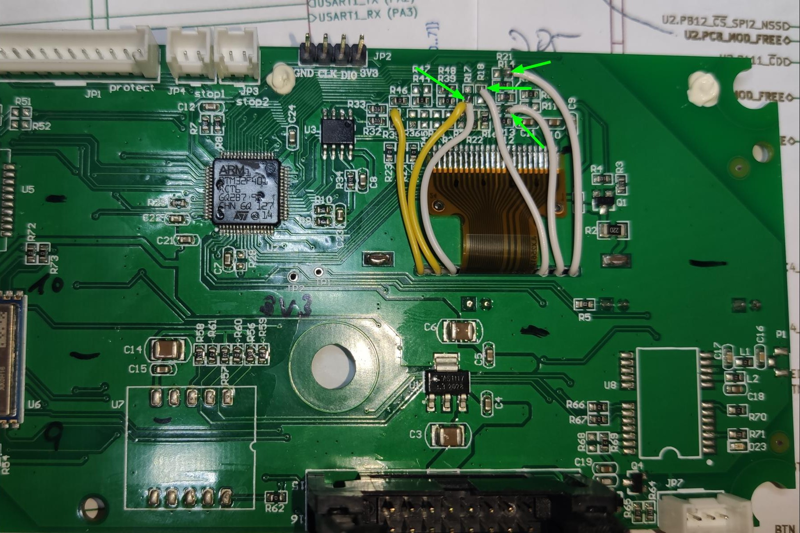

([back to README][README])

## YardForce SA/SC/NX-Type 18 Buttons, 3 LEDs, 256*64 Pixel LC-Display, RM-EC3-V1.1 MODs

### Buttons (*mandatory*)

With the stock component placement, Button-Home and Button-Play get routed to the main (black) 16 pin connector (JP5).
But we need them routed to the MCU.

Solder two cables:

1. S8/D9 front-side, to back-side R35-upper-pin (Play button)
2. S10/D7 front-side, to back-side R27-upper-pin (Home button)

(<a href="#readme-top">back to top</a>)

### Emergency Stop Switches (*optional*)

If you also like to use your two Stock-Stop-Switch cables, and you should, because you need the four OM- Hall-Plugs for the remaining hall-sensors:

Solder another two cables:

1. JP5-Pin14 front-side, to back-side U7-Pin1
2. JP5-Pin6 front-side, to back-side U7-Pin2

(<a href="#readme-top">back to top</a>)

### Emergency Hall Switches (*optional*)

If you also like to use your original "4-leg cable for the 4 hall sensors", then you need to solder 4 more cables:

Solder four cables:

1. JP5-Pin15 front-side, to back-side R17-lower-pin
2. JP5-Pin16 front-side, to back-side R18-upper-pin
3. JP5-Pin12 front-side, to back-side R13-right-pin
4. JP5-Pin10 front-side, to back-side R21-right-pin

> **Warning**
> As you might know, the hall sensors are driven by 5V, whereas the MCU is running at 3.3V.
> All used GPIO ports of this modification, are so called "5V tolerant" ports.
> But there might happen electrical cases like: VREG delay or short on 3.3V line, which could kill the "5V tolerant" pin of your MCU.
> To be on the save side for such odd things happen, I highly advice to remove the 5V pull-up resistor on your Hall-PCB, or move it aside like shown on this picture:

(<a href="#readme-top">back to top</a>)

([back to README][README])

[README]: README.md
