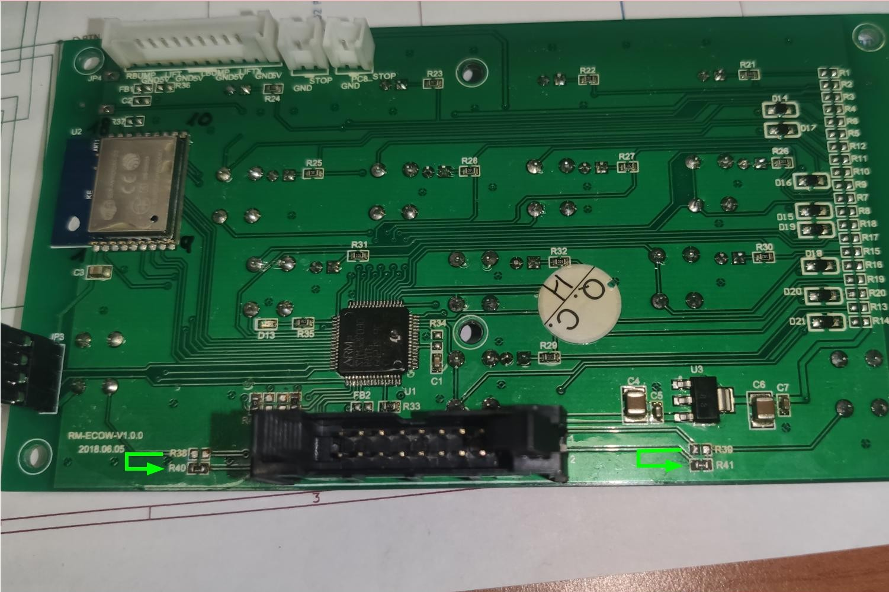
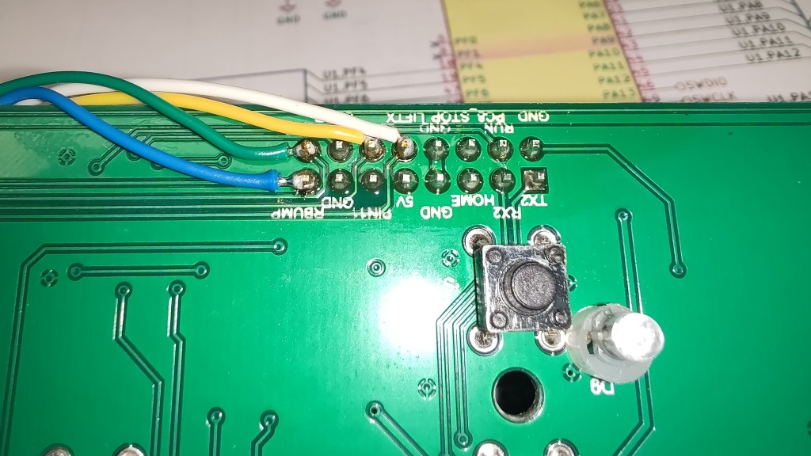
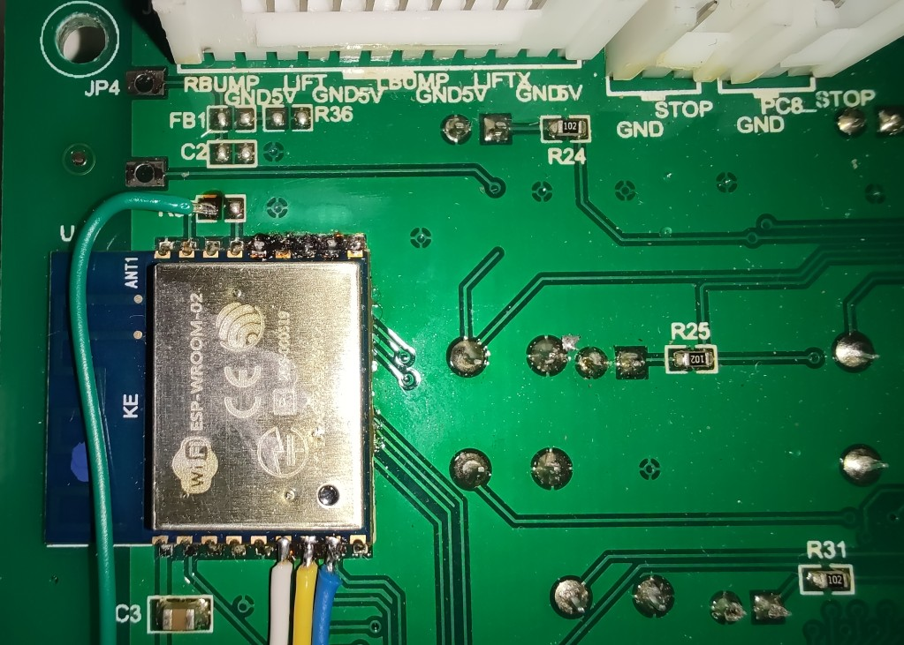
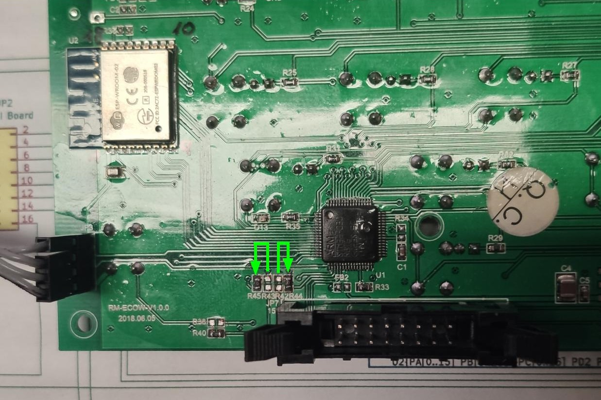

([back to README][README])

## YardForce SA/SC/NX-Type 10 Buttons, 12 LEDs, RM-ECOW-V1.0.0 MODs

  

### Buttons (*mandatory*)

With the stock component placement, Button-Home and Button-Play get routed to the main (black) 16 pin connector (JP2/J6).
But we need them routed to the MCU.
Luckily the PCB is already prepared for this.

Move the 0 Ohm (bridge) resistors:

1. R39 to the NonPlaced R41 position (Button-Home)
2. R38 to (NP) R40 (Button-Play)

You might also simply bridge R40 and R41, but for me it was simpler to move them

(<a href="#readme-top">back to top</a>)

### Emergency Hall Switches (*optional*)

If you also like to use your original "4-leg cable for the 4 hall sensors", then you need to solder 4 more cables:

Solder four cables:

1. JP2-Pin10 to U2-Pin6 (LIFTX to PF6)
2. JP2-Pin12 to U2-Pin7 (LBUMP to PA12)
3. JP2-Pin15 to U2-Pin8 (RBUMP to PA11)
4. JP2-Pin16 to U2-Pin17 (LIFT to PA8)

> **Warning**
> As you probably know, the hall sensors are driven by 5V, whereas the MCU is running at 3.3V. 
> All used GPIO ports of this modification, are so called "5V tolerant" ports. 
> **But** there might happen electrical cases like: VREG delay or short on 3.3V line, which could kill the "5V tolerant" pin of your MCU.
> To be on the save side for such odd cases, I highly recommend to remove the 5V pull-up resistor from your Hall-PCB, or move it aside like shown on this picture:

(<a href="#readme-top">back to top</a>)

### Emergency Stop Switches (*optional*)

If you also like to use your two Stock-Stop-Switch cables, and you should, as you need the four OM- Hall-Plugs for the remaining hall-sensors:

Move the 0 Ohm (bridge) resistors:

1. R42 to the NonPlaced R44 position (JP5 Stop)
2. R43 to (NP) R45 (JP6 Stop)

You might also simply bridge R44 and R45, but for me it was simpler to move them

([back to README][README])

[README]: README.md
