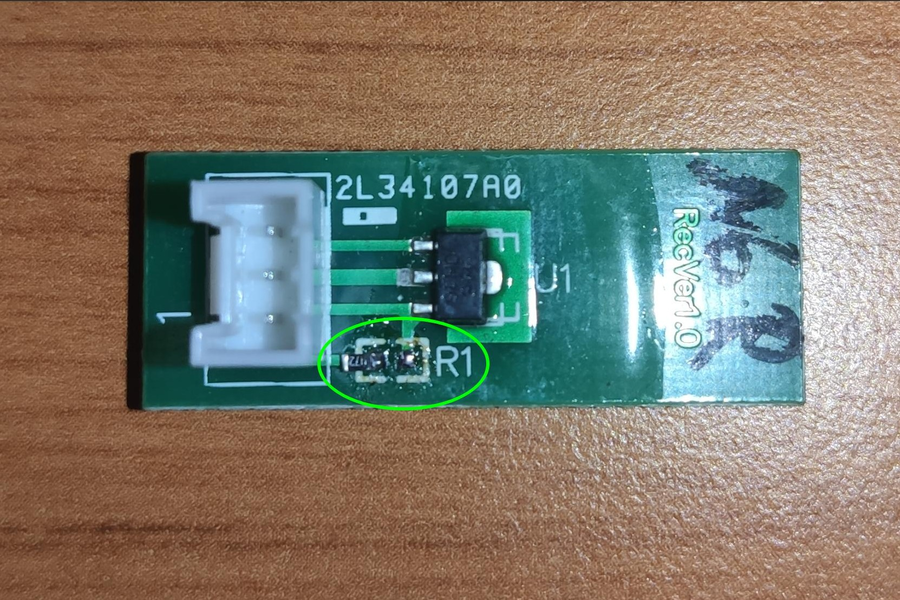

([back to README][README])

## YardForce SA/SC/NX-Type 9 Buttons, 11 LEDs, RM-ECOW-V1.1.0 MODs

### Buttons (*mandatory*)

With the stock component placement, Button-Home and Button-Play get routed to the main (black) 16 pin connector (JP2).
But we need them routed to the MCU.
Luckily the PCB is already prepared for this.

Move the 0 Ohm (bridge) resistors:

1. R39 to the NonPlaced R42 position (Button-Home)
2. R34 to (NP) R37 (Button-Play)

You might also simply bridge R42 and R37, but for me it was simpler to move them.

(<a href="#readme-top">back to top</a>)

### Emergency Hall Switches (*optional*)

If you also like to use your original "4-leg cable for the 4 hall sensors", then you need to solder 4 more cables:

Solder four cables:

1. JP1-Pin39 to U6-Pin8 (RBUMP to PC9)
2. JP1-Pin40 to U6-Pin2 (LIFT to PA8)
3. JP1-Pin36 to U6-Pin15 (LBUMP to PC8)
4. JP1-Pin34 to R8-left-pin (LIFTX to PA9)

> **Warning**
> As you probably know, the hall sensors are driven by 5V, whereas the MCU is running at 3.3V. 
> All used GPIO ports of this modification, are so called "5V tolerant" ports. 
> **But** there might happen electrical cases like: VREG delay or short on 3.3V line, which could kill the "5V tolerant" pin of your MCU.
> To be on the save side for such odd cases, I highly recommend to remove the 5V pull-up resistor from your Hall-PCB, or move it aside like shown on this picture:

(<a href="#readme-top">back to top</a>)

### Emergency Stop Switches (*optional*)

If you also like to use your 2 stock Stop-Switch cables, you need to bridge or move 2 further resistors:

Move the 0 Ohm (bridge) resistors:

1. R61 to the NonPlaced R63 position (JP8 Stop)
2. R46 to (NP) R56 (JP6 PC8-Stop)

You might also simply bridge R63 and R56, but for me it was simpler to move them.

(<a href="#readme-top">back to top</a>)

([back to README][README])

[README]: README.md
