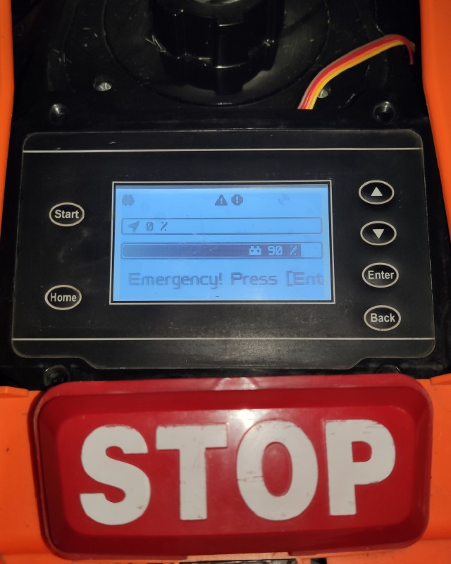
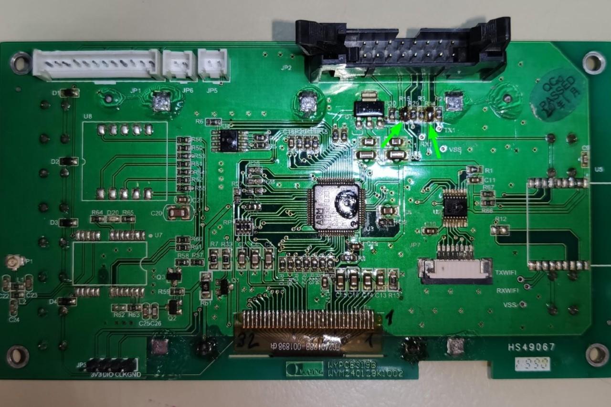

([back to README][README])

## YardForce SA/SC-PRO-Type 6 Buttons, 240*160 Dot-Matrix-Display, HS49067 MODs

### Buttons (*mandatory*)

With the stock component placement, Button-Home and Button-Play get routed to the main (black) 16 pin connector (JP2/J6).
But we need them routed to the MCU.
Luckily the PCB is already prepared for this.

1. Bridge R14 (Button-Start/Play)
2. Bridge R15 (Button-Home)

(<a href="#readme-top">back to top</a>)

([back to README][README])

[README]: README.md
