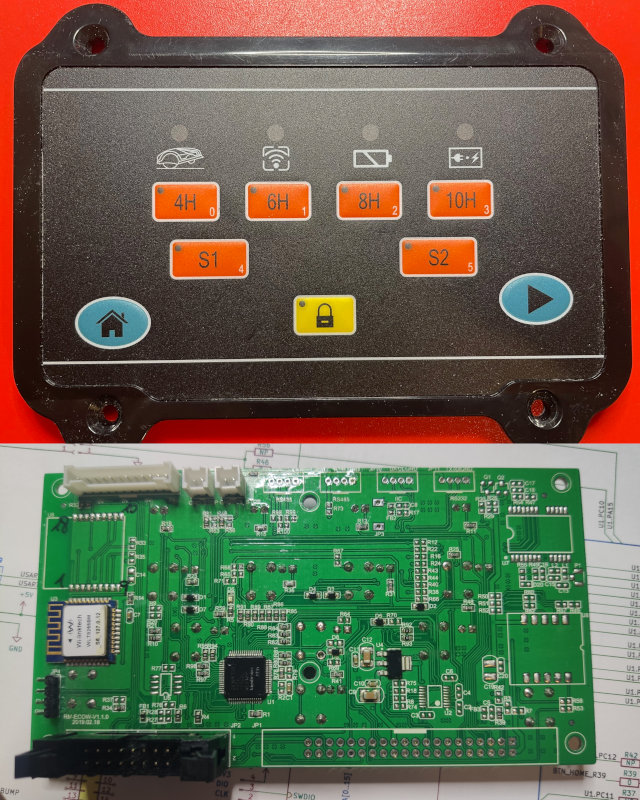

<a name="readme-top"></a>

[![Contributors][contributors-shield]][contributors-url]
[![Forks][forks-shield]][forks-url]
[![Stargazers][stars-shield]][stars-url]
[![Issues][issues-shield]][issues-url]
[![MIT License][license-shield]][license-url]

<!-- CoverUI model images -->
<br />
<div align="center">
  <a href="#hardware-modifications-by-model">
    
  </a>
  <a href="README-MOD-YF-SASCNX_RM-ECOW-V1.0.0.md">
    
  </a>
  <a href="README-MOD-YF-SASCNX_RM-ECOW-V1.1.0.md">
    
  </a>
  <a href="README-MOD-YF-SASCNX_RM-EC3-V1.1.md">
    
  </a>
  <a href="README-MOD-YF-SASC_PRO_HS49067.md">
    
  </a>

  <h3 align="center">OM CoverUI Firmware for Stock YardForce PCBs</h3>

  <p align="center">

#### Tested/working with

| YardForce Model                  | PCB Label                  | <a href="https://en.wikipedia.org/wiki/Microcontroller">MCU</a> Variant |
| :-------------------------------- | :------------------------: | :---: |
| Classic 500                      | RM-ECOW-V1.3.0, 2020.05.08 | STM32F030R8, GD32F330R8 |
| Classic 500B                     | RM-ECOW-V1.3.1, 2021.08.09 | STM32F030R8[^1], GD32F330R8 |
| SA/SC/NX-Type (10 Buttons, 12 LEDs) | RM-ECOW-V1.0.0, 2018.06.05 | STM32F030R8 |
| SA/SC/NX-Type (9 Buttons, 11 LEDs)e | RM-ECOW-V1.1.0, 2019.02.18 | STM32F030R8, GD32F330R8 |
| NX100i (18 Buttons, 3 LEDs, 256*64 Pixel LC-Display), SA/SC/NX-Type | RM-EC3-V1.1, 20210619 | STM32F401RC |
| SA/SC-PRO-Type Rev6 (6 Buttons, 240*128 Pixel LC-Display)    | HS49067, WYPCB319B | STM32F030RC |

  [^1]: Not yet tested, but it's expected that it will also work flawless

  </p>
</div>


## About The Project

For those, who still have their stock *YardForce (Rev6)* Cover-UI available and want to get it running together with [OpenMower](https://github.com/ClemensElflein/OpenMower), I ported OM's CoverUI <abbr title="Firmware">FW</abbr> functionality to a couple of them (see [Tested/working with](#testedworking-with)).

<p align="right">(<a href="#readme-top">back to top</a>)</p>


## Getting Started

### Prerequisites

* Compatible stock *YardForce* Cover-UI/Button-Board or Display (see [Tested/working with](#testedworking-with))
* Soldering Iron
* ST-Link programmer/debugger

### Hardware Modifications by Model

Every CoverUI model require some hardware modifications.

Please check here, what modifications are required for your CoverUI model:

- [YardForce Classic 500, RM-ECOW-V1.3.0](README-MOD-YF-C500_RM-ECOW-V1.3.0.md)
- [YardForce Classic 500**B**, RM-ECOW-V1.3.1](README-MOD-YF-C500B_RM-ECOW-V1.3.1.md)
- [YardForce SA/SC/NX-Type 10 Buttons, 12 LEDs, RM-ECOW-V1.0.0](README-MOD-YF-SASCNX_RM-ECOW-V1.0.0.md)
- [YardForce SA/SC/NX-Type 9 Buttons, 11 LEDs, RM-ECOW-V1.1.0](README-MOD-YF-SASCNX_RM-ECOW-V1.1.0.md)
- [YardForce NX100i (SA/SC/NX-Type) 18 Buttons, 3 LEDs, 256*64 Pixel LC-Display, RM-EC3-V1.1](README-MOD-YF-SASCNX_RM-EC3-V1.1.md)
- [YardForce SA/SC-PRO-Type 6 Buttons, 240*160 Dot-Matrix-Display, HS49067](README-MOD-YF-SASC_PRO_HS49067.md)


## Flash Firmware

### Programmer/Debugger

You need an ST-Link programmer/debugger like this cheap *ST-Link (V2) clone*:


There're two generic ways to get the Firmware into your MCU.<br>
Either you flash the binary directly, or you compile it by yourself with [PlatformIO](https://platformio.org/).

### Firmware binaries

1. Goto [Releases](/releases)
2. Download `firmware-stock.zip`
3. Unpack it somewhere

The file name syntax of the included firmware binaries is:  `firmware_<MDL>_<MCU>[_<opt MOD>, ...].bin`

> **Warning**
> Only install the \<MOD> version, for which you also made the required hardware modifications!
> See [Hardware Modifications by Model](#hardware-modifications-by-model)


### ST-Link (flash binary)

> **Note**
> Updated 05/07/2023

It turns out that ST-Link GUI tool is some how flawy, why I recommend to use the `st-flash` console command.

Open a terminal/console, then:

* `st-info --descr` should return either:
  * `F0xx`, which identify your PCB's MCU as a 'STM32F030R8' (i.e. Classic 500)
  * `F1xx Medium-density` or `STM32F1xx_MD` which identify a 'GD32F330R8' MCU (i.e. Classic 500)
  * `F09X` identifies a 'STM32F030RC' MCU (i.e. SAxPRO Display)
* Unplug everything from you stock CoverUI PCB and connect your ST-Link to GND, CLK, DIO and 3V3. Take special attention to hit the '3.3V' pin of your ST-Link!! Now simply:<br>
 `st-flash write firmware_<mdl>_<mcu type>[_<opt mod>, ...].bin 0x08000000` which should log at the end something like 'Flash written and verified! jolly good!'

When done, re-plug your ST-Link and you should see a quick power-on animation.

If st-flash fails with an error like "Flash memory is write protected", we need to unlock it.<br>
I used [OpenOCD][OpenOCD-url] for unlocking it. Try `openocd --version` to check if [OpenOCD][OpenOCD-url] is already installed.

Unlock your flash via:

```openocd -f interface/stlink.cfg -f target/stm32f0x.cfg -c "init" -c "halt" -c "stm32f0x unlock 0" -c "shutdown"```

Now, try again flashing by: `st-flash write firmware_<mdl>_<mcu type>[_<opt mod>, ...].bin 0x08000000`


### PlatformIO

[PlatformIO](https://platformio.org/) is a [Visual Studio Code](https://code.visualstudio.com/) extension. Once installed, do:

- `PlatformIO` (left bar)
- `PIO Home` -> `Open`
- `Open Project` cloned repository branch -> CoverUI/Firmware/CoverUI (contains platformio.ini)
- Wait till tools got loaded (bottom right status info)
- In bottombar click `Switch PlatformIO Project Environment` and choose whatever MCU, MOD & programmer/debugger- probe you use
- Wait till tools got loaded (bottom right status info)
- Finally press `PlatformIO: Upload` (right arrow symbol) in bottombar. After it compiled, linked and uploaded, it should reboot and do a short power-on LED animation.
- If you get an "Error: stm32x device protected", simply upload a second time. Look like I placed the "unlock" command some how to late. 


<p align="right">(<a href="#readme-top">back to top</a>)</p>


<!-- USAGE EXAMPLES -->
## Usage

> **Note**
> Updated 11/07/2023

Once flashed, the CoverUI should show you a quick LED animation when powered on.

### Meaning of the LEDs:

| C500(B) | SA/SC/NX-Type,<br>9&nbsp;Buttons, 11&nbsp;LEDs | SA/SC/NX-Type,<br>10&nbsp;Buttons, 12&nbsp;LEDs | NX100i<br>(SA/SC/NX-Type),<br>18&nbsp;Buttons, 3&nbsp;LEDs,<br> 256*64 Pixel LC-Display | SA/SC-PRO<br>(240*160 Pixel LC-Display) | Remark |
| :-------: | :-----: | :-------: | :----: | :----: | ----- |
| 2hr&nbsp;-&nbsp;8hr | 4H&nbsp;-&nbsp;10H | 4H&nbsp;-&nbsp;10H |  |  | 4 digi GPS quality progressbar. Blink = No GPS-Fix
| S1 | :heavy_check_mark: | :heavy_check_mark: |  |  | ROS State:<br><b>On</b> = Running (idle)<br> <b>Blink-slow</b> = Autonomous mode (mowing, (un-)docking)<br><b>Blink-fast</b> = Area recording<br><b>Off</b> = ROS not running |
| S2 | :heavy_check_mark: | :heavy_check_mark: |  |  | ROS Sub-State:<br><b>On</b> = not used<br> <b>Blink-slow</b> = Docking or Record-Outline<br><b>Blink-fast</b> = Undocking or Record-Obstacle<br><b>Off</b> = Idle or Mowing |
| Lifted | :heavy_check_mark: | :heavy_check_mark: |  |  | Emergency:<br><b>On</b> = No heart beat for more than 0.5s?!?<br> <b>Blink-slow</b> = Lifted or tilted<br><b>Blink-fast</b> = Stop button pressed<br><b>Off</b> = No Emergency |
| Wire | WLAN | WLAN |  |  | GPS Quality:<br><b>On</b> = \<25%<br><b>Blink-fast</b> = \<50%<br><b>Blink-slow</b> = \<75%<br><b>Off</b> = \>75% |
| Battery | :heavy_check_mark: | :heavy_check_mark: |  |  | <b>On</b> = Empty |
| Charge | :heavy_check_mark: | :heavy_check_mark: |  |  | <b>On</b> = Fully charged<br><b>Blink-slow</b> = Approx. 50% charged<br><b>Blink-fast</b> = Empty<br><b>Off</b> = Not docked |
| Mon-Sun | :x: | :x: |  |  | 7 digit battery-charge-state progress bar |


### Button usage:

| C500(B) | SA/SC/NX-Type,<br>9&nbsp;Buttons, 11&nbsp;LEDs | SA/SC/NX-Type,<br>10&nbsp;Buttons, 12&nbsp;LEDs | NX100i (SA/SC/NX-Type),<br>18&nbsp;Buttons, 3&nbsp;LEDs,<br> 256*64 Pixel LC-Display | SA/SC-PRO<br>(240*160 Pixel LC-Display) | Remark |
| :-------: | :----: | :---------------------------------: | :-----: | :----: | ----- |
| <kbd>Home</kbd> | :heavy_check_mark: | :heavy_check_mark: | :heavy_check_mark: | :heavy_check_mark: | Go home (docking station) |
| <kbd>▶</kbd> | :heavy_check_mark: | :heavy_check_mark: | :heavy_check_mark: | <kbd>Start</kbd> | Start mowing or continue |
| <kbd>S1</kbd> | :heavy_check_mark: | :heavy_check_mark: | :heavy_check_mark: | :x: | Start area recording if 'idle'. Pause if 'mowing' |
| <kbd>S2</kbd> | :heavy_check_mark: | :heavy_check_mark: | :heavy_check_mark: | :x: | Skip over to next area if 'mowing'. Long press (2-3s) in 'idle', delete all recorded areas! |
| <kbd>Lock</kbd> | :heavy_check_mark: | :heavy_check_mark: | :x: | <kbd>Enter</kbd> | Long press (2-3s) reset emergency |
| <kbd>OK</kbd>+<kbd>Sun</kbd> | <kbd>Lock</kbd>+<kbd>10H</kbd> | <kbd>Setup</kbd>+<kbd>10H</kbd> | <kbd>MENU</kbd>+<kbd>BACK</kbd> | :x: | Trigger power-on animation.<br>This is mainly for mounting validation, to ensure that you hit all LED guidance holes |
| <kbd>OK</kbd>+<kbd>Clock</kbd> | <kbd>Lock</kbd>+<kbd>4H</kbd> | <kbd>Setup</kbd>+<kbd>4H</kbd> | <kbd>MENU</kbd>+<kbd>0</kbd> | :x: | Display CoverUI- firmware version. LED only models will show the version as a number sequence[^2], which should show (as of writing) 206 |
| <kbd>Mon</kbd> | <kbd>4H</kbd> | <kbd>4H</kbd> | <kbd>1</kbd> |  | Volume up[^3] |
| <kbd>Tue</kbd> | <kbd>6H</kbd> | <kbd>6H</kbd> | <kbd>2</kbd> |  | Volume down[^3] |
| <kbd>Wed</kbd> | :x: | <kbd>8H</kbd> | <kbd>3</kbd> | <kbd>Back</kbd> | ~~Next language~~ Language selection has moved to mower_config[^3] |


[^2]: A 'number sequence' get displayed via the 'Mon(0)' to 'Sun(6)' or '4H(0)' to 'S2(5)' LEDs, whereas every short blinking 'Lifted' LED indicate a new digit.
Larger digits, get displayed with multiple digit LEDs.
I.e. 9 = 'Sun(6)' together with 'Thu(3)'

[^3]: 'Improve-Sound' branch  of 'OpenMower' Pico Firmware presupposed

<p align="right">(<a href="#readme-top">back to top</a>)</p>

## Final work

Lastly, for connecting you CoverUI, you need a cable to plug it into OM's Mainboard "UI Board" connector.

I simply cropped the 16 pin connector from my original cable and crimped OM's plug.

<span style="color:red;">But before blindly doing it, validate if the cables pin 1 mark, also matches the 16 pin female/male connector!</span>


You're done!

Plug it into `UI Board` connector of your OM mainboard and
check section [usage](#usage) about the [LED](#meaning-of-the-leds) and [Button](#button-usage) usage.


## Version History

| Version [^4] | Changes | Date |
| ------- | ------- | ---- |
| 2.06    | - Add MOD_HALL support to YardForce RM-ECOW-V1.0.0<br>- Fix heap overflow which could happen when an action button got pressed multiple (10-20) times | 2024-09-29
| 2.05    | - YardForce RM-ECOW-V1.1.0 support<br>- Backside alive LED is now software driven (hwtimer independent)<br>- Fix emergency-clear LED-countdown for RM-ECOW-V1.0.0| 2024-06-30
| 2.04    | - YardForce RM-ECOW-V1.0.0 support<br>- Dropped separate versioning<br>- Fully refactored | 2023-11-14
| 1.00    | - YardForce SAxPRO (Rev6) Dot-Matrix-Display support | 2023-09-27
| 1.00    | - Stock-Cable support for rain & hall sensors<br>- Classic 500B support | 2023-05-13
|  NA       | First OM's CoverUI port for YardForce Classic 500 | 2023-05-01

[^4]: Press sys-req button combo 'Display CoverUI- firmware version' (see [Button Usage](#button-usage)) to get your installed FW version displayed

<!-- CONTRIBUTING -->
## Contributing

Contributions are what make the open source community such an amazing place to learn, inspire, and create. Any contributions you make are **greatly appreciated**.

If you have a suggestion that would make this better, please fork the repo and create a pull request. You can also simply open an issue with the tag "enhancement".
Don't forget to give the project a star! Thanks again!

1. Fork the Project
2. Create your Feature Branch (`git checkout -b feature/AmazingFeature`)
3. Commit your Changes (`git commit -m 'Add some AmazingFeature'`)
4. Push to the Branch (`git push origin feature/AmazingFeature`)
5. Open a Pull Request

<p align="right">(<a href="#readme-top">back to top</a>)</p>


<!-- LICENSE -->
## License

Distributed under the MIT License. See `LICENSE.txt` for more information.

<p align="right">(<a href="#readme-top">back to top</a>)</p>


<!-- ACKNOWLEDGMENTS -->
## Acknowledgments

* [OpenMower](https://github.com/ClemensElflein/OpenMower)
* [Mowgli](https://github.com/cloudn1ne/Mowgli)
* [PlatformIO](https://platformio.org/)

<p align="right">(<a href="#readme-top">back to top</a>)</p>


<!-- MARKDOWN LINKS & IMAGES -->
<!-- https://www.markdownguide.org/basic-syntax/#reference-style-links -->
[contributors-shield]: https://img.shields.io/github/contributors/ClemensElflein/CoverUI.svg?style=for-the-badge
[contributors-url]: https://github.com/ClemensElflein/CoverUI/graphs/contributors
[forks-shield]: https://img.shields.io/github/forks/ClemensElflein/CoverUI.svg?style=for-the-badge
[forks-url]: https://github.com/ClemensElflein/CoverUI/network/members
[stars-shield]: https://img.shields.io/github/stars/ClemensElflein/CoverUI.svg?style=for-the-badge
[stars-url]: https://github.com/ClemensElflein/CoverUI/stargazers
[issues-shield]: https://img.shields.io/github/issues/ClemensElflein/CoverUI.svg?style=for-the-badge
[issues-url]: https://github.com/ClemensElflein/CoverUI/issues
[license-shield]: https://img.shields.io/github/license/ClemensElflein/CoverUI.svg?style=for-the-badge
[license-url]: https://github.com/ClemensElflein/CoverUI/blob/master/LICENSE.txt
[OpenOCD-url]: https://openocd.org/pages/about.html
