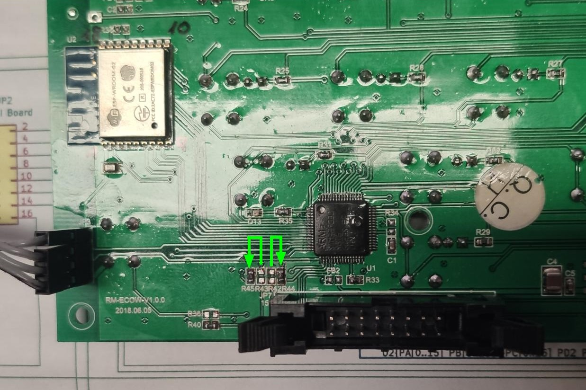
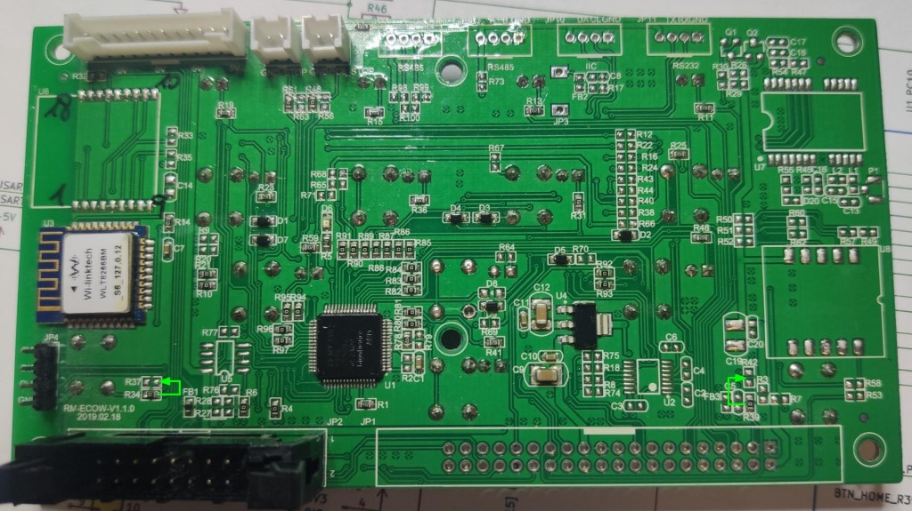
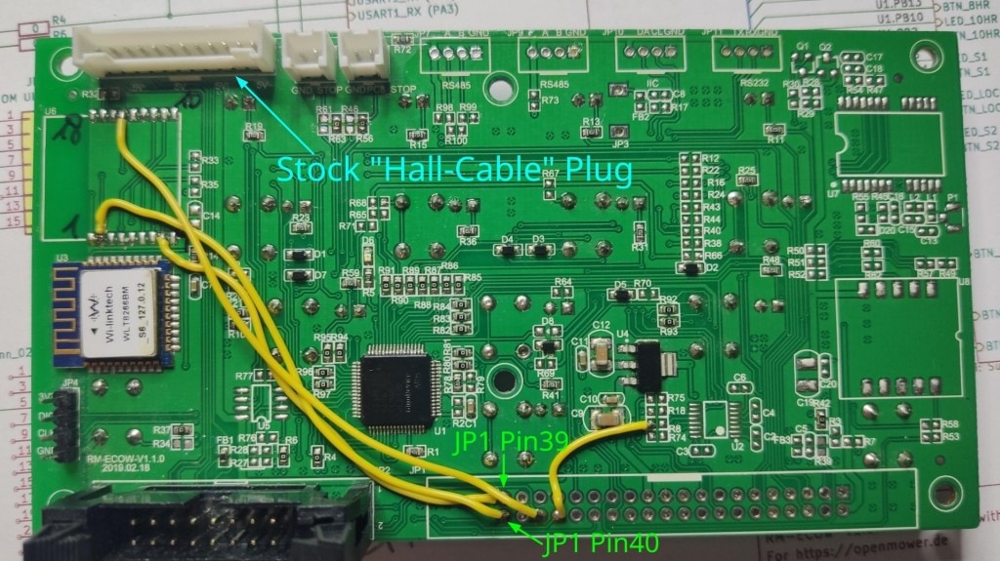
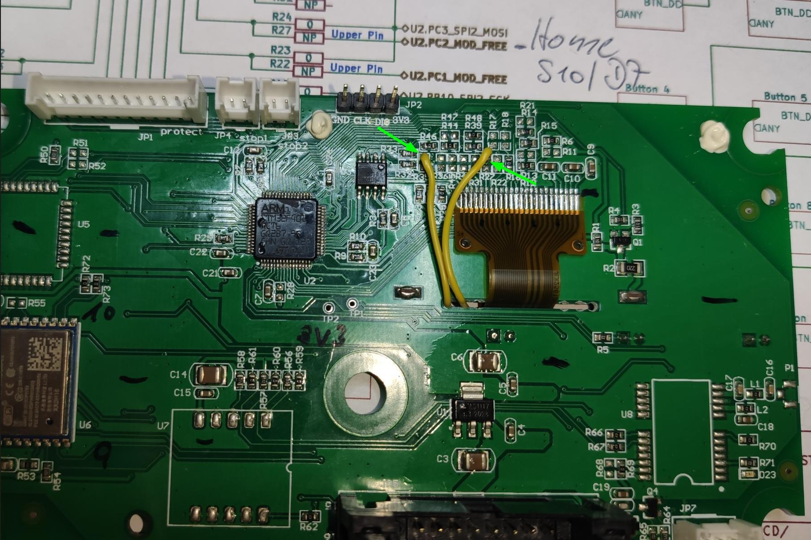
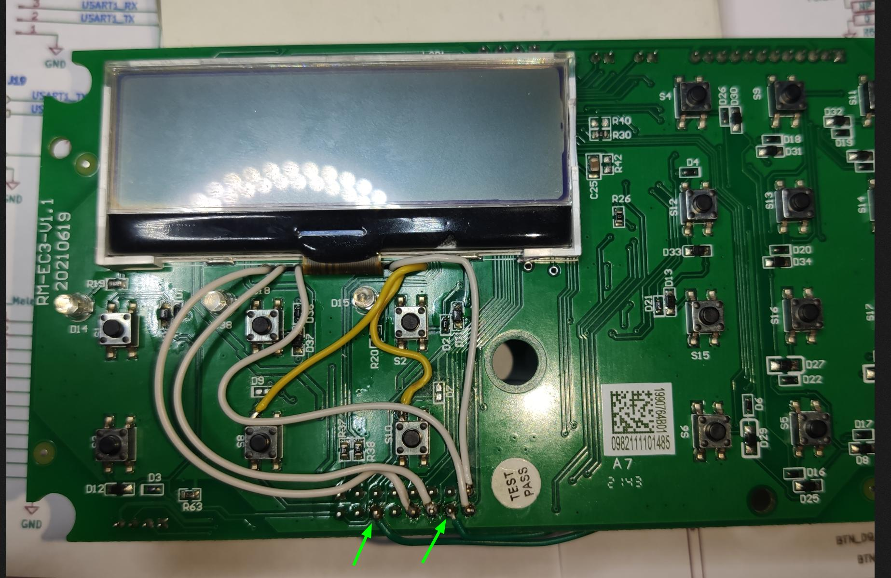
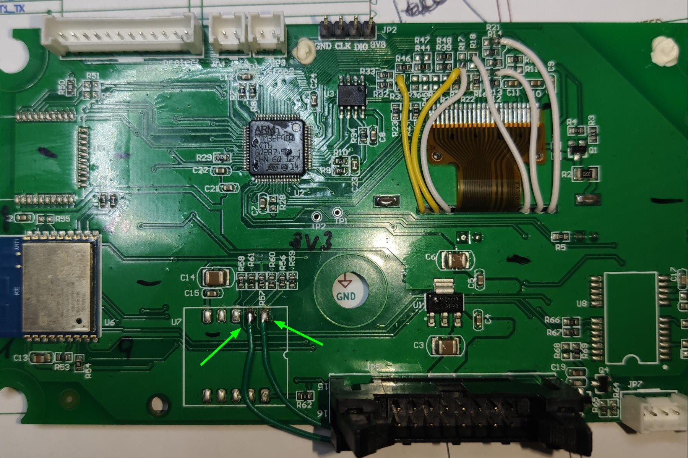
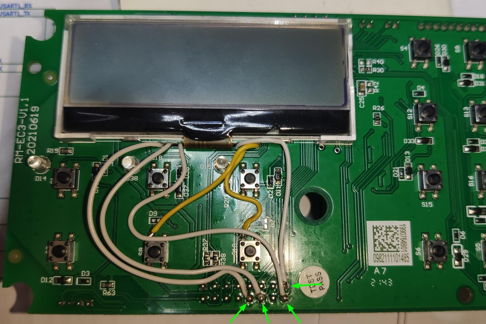
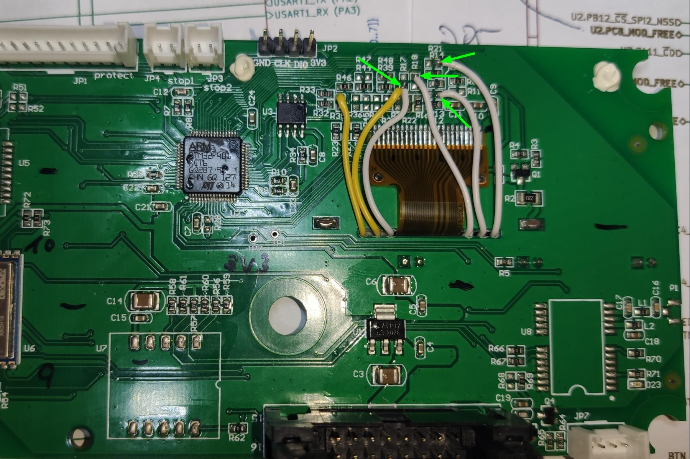

<a name="readme-top"></a>

[![Contributors][contributors-shield]][contributors-url]
[![Forks][forks-shield]][forks-url]
[![Stargazers][stars-shield]][stars-url]
[![Issues][issues-shield]][issues-url]
[![MIT License][license-shield]][license-url]

<!-- PROJECT LOGO -->
<br />
<div align="center">
  <a href="images/IMG_Overview.jpg">
    
  </a>
  <a href="images/IMG_Overview_RM-ECOW-V100.jpg">
    
  </a>
  <a href="images/IMG_Overview_RM-ECOW-V110.jpg">
    
  </a>
  <a href="images/IMG_Overview_RM-ECOW-V1.1.jpg">
    
  </a>
  <a href="images/IMG_Overview_SAxPRO.jpg">
    
  </a>

  <h3 align="center">OM CoverUI Firmware for Stock YardForce PCBs</h3>

  <p align="center">

#### Tested/working with

| YardForce Model                  | PCB Label                  | <a href="https://en.wikipedia.org/wiki/Microcontroller">MCU</a> Variant |
| :-------------------------------- | :------------------------: | :---: |
| Classic 500                      | RM-ECOW-V1.3.0, 2020.05.08 | STM32F030R8, GD32F330R8 |
| Classic 500B                     | RM-ECOW-V1.3.1, 2021.08.09 | STM32F030R8[^1], GD32F330R8 |
| NX80i (10 Buttons, 12 LEDs), SA/SC/NX-Type | RM-ECOW-V1.0.0, 2018.06.05 | STM32F030R8 |
| SA650 (9 Buttons, 11 LEDs), SA/SC/NX-Type | RM-ECOW-V1.1.0, 2019.02.18 | GD32F330R8 |
| NX100i (18 Buttons, 3 LEDs, 256*64 Pixel LC-Display), SA/SC/NX-Type | RM-EC3-V1.1, 20210619 | STM32F401RC |
| SA/SC-PRO-Type Rev6 (6 Buttons, 240*128 Pixel LC-Display)    | HS49067, WYPCB319B | STM32F030RC |

  [^1]: Not yet tested, but it's expected that it will also work flawless

  </p>
</div>


<!-- TABLE OF CONTENTS -->
<details>
  <summary><h2>Table of Contents</h2></summary>
  <ol>
    <li>
      <a href="#about-the-project">About The Project</a>
    </li>
    <li>
      <a href="#getting-started">Getting Started</a>
      <ul>
        <li><a href="#prerequisites">Prerequisites</a></li>
        <li><a href="#hardware-modifications-by-model">Hardware Modifications by Model</a>
              <ul>
        <li><a href="#yardforce-classic-500-rm-ecow-v130">YardForce Classic 500, RM-ECOW-V1.3.0</a></li>
        <li><a href="#yardforce-classic-500b-rm-ecow-v131">YardForce Classic 500B, RM-ECOW-V1.3.1</a></li>
        <li><a href="#yardforce-nx80i-10-buttons-12-leds-sascnx-type-rm-ecow-v100">YardForce NX80i (10 Buttons, 12 LEDs), SA/SC/NX-Type, RM-ECOW-V1.0.0</a></li>
        <li><a href="#yardforce-sa650-9-buttons-11-leds-sascnx-type-rm-ecow-v110">YardForce SA650 (9 Buttons, 11 LEDs), SA/SC/NX-Type, RM-ECOW-V1.1.0</a></li>
        <li><a href="#yardforce-nx100i-18-buttons-3-leds-25664-pixel-lc-display-sascnx-type-rm-ec3-v11">YardForce NX100i (18 Buttons, 3 LEDs, 256*64 Pixel LC-Display), SA/SC/NX-Type, RM-EC3-V1.1</a></li>
        <li><a href="#yardforce-sasc-pro-type-rev6-6-buttons-240160-dot-matrix-display-hs49067-wypcb319b">YardForce SA/SC-PRO-Type Rev6 (6 Buttons, 240*160 Dot-Matrix-Display), HS49067, WYPCB319B</a></li>
      </ul>
        </li>
        <li><a href="#flash-firmware">Flash Firmware</a></li>
      </ul>
    </li>
    <li><a href="#usage">Usage</a>
      <ul>
        <li><a href="#meaning-of-the-leds">Meaning of the LEDs</a></li>
        <li><a href="#button-usage">Button usage</a></li>
      </ul>
    </li>
    <li><a href="#final-work">Final work</a></li>
    <li><a href="#version-history">Version History</a></li>
    <li><a href="#contributing">Contributing</a></li>
    <li><a href="#license">License</a></li>
    <li><a href="#acknowledgments">Acknowledgments</a></li>
  </ol>
</details>

<!-- ABOUT THE PROJECT -->
## About The Project

For those, who still have their stock *YardForce (Rev6)* Cover-UI available and want to get it running together with [OpenMower](https://github.com/ClemensElflein/OpenMower), I ported OM's CoverUI <abbr title="Firmware">FW</abbr> functionality to a couple of them (see [Tested/working with](#testedworking-with)).

<p align="right">(<a href="#readme-top">back to top</a>)</p>


<!-- GETTING STARTED -->
## Getting Started

### Prerequisites

* Compatible stock *YardForce* Cover-UI/Button-Board or Display (see [Tested/working with](#testedworking-with))
* Soldering Iron
* ST-Link programmer/debugger (or Picoprobe if you've a STM32 MCU)

### Hardware Modifications by Model


<!-- Hardware Modifications by Model: Classic 500 -->
<details>
  <summary><h3>YardForce Classic 500, RM-ECOW-V1.3.0</h3></summary>

  

### Hardware Modifications: Buttons (*mandatory*)

With the stock component placement, Button-Home and Button-Play get routed to the main (black) 16 pin connector (JP2/J6).
But we need them routed to the MCU.
Luckily the PCB is already prepared for this.

[](images/IMG_PCB_Changes.jpg)
<sup>(The yellow cable (to R5/C2) should not harm you. This is the NRST signal which is only required if you bug the code (like me) during development)</sup>

Move the 0 Ohm (bridge) resistors:
1. R33 to the NonPlaced R34 position (Button-Home)
2. R37 to (NP) R42 (Button-Play)
   
You might also simply bridge R34 and R42, but for me it was simpler to move them

### Hardware Modification: Rain Sensor (*optional*)

If you also like to use the Stock-Rain-Sensor cabling, you need to solder a separate cable from FB2 to the non-placed R79.
See the yellow cable on the following images:

[](images/IMG_Stock-Cables-overview.jpg)
[](images/IMG_Stock-Cables-detail2.jpg)
[](images/IMG_Stock-Cables-rain1.jpg)

### Hardware Modification: Emergency Hall Sensors (*optional*)

If you also like to use your Stock-Hall-Sensor cabling (2 \* stop-button & 2 \* wheel-lift):

Then you need to solder one more R- bridge as well as 3 more separate cables.
Take into **attention** that you need to make all 4 steps:

1. Move R52 to (non-placed) R57 (see green arrow on image), or simple bridge R57 (i.e. with 32kg solder)
2. Solder a cable-bridge from Q4/R61 to U5/Pin3 (see left green cable)
3. Solder a cable-bridge from the bottom end of R76 to U5/Pin2 (see white cable)
4. Solder a cable-bridge from Q6/R83 to U5/Pin10 (see right green cable)

[](images/IMG_Stock-Cables-overview-hall.jpg)
[](images/IMG_Stock-Cables-detail3.jpg)
[](images/IMG_Stock-Cables-detail4.jpg)

I only made it with colored cables for a more clear documentation.
If you've repair-wire like [this](https://de.farnell.com/roadrunner/rrp-a-105/draht-0-15mm-sortiert-pk-4/dp/5017233), it might look better, like this:


</details>


<!-- Hardware Modifications by Model: Classic 500B -->
<details>
  <summary><h3>YardForce Classic 500B, RM-ECOW-V1.3.1</h3></summary>

  

### Hardware Modifications: Buttons (*mandatory*)

With the stock component placement, Button-Home and Button-Play get routed to the main (black) 16 pin connector (JP2/J6).
But we need them routed to the MCU.
Luckily the PCB is already prepared for this.

[](images/IMG_PCB_Changes_500B.jpg)

Move the 0 Ohm (bridge) resistors:

1. R33 to the NonPlaced R34 position (Button-Home)
2. R37 to (NP) R42 (Button-Play)

You might also simply bridge R34 and R42, but for me it was simpler to move them


### Hardware Modification: Rain Sensor (*optional*)

If you also like to use the Stock-Rain-Sensor cabling, you need to solder a separate cable from FB2 to the non-placed R79.
See the white cable on the following images:

[](images/IMG_Stock-Cables-overview_500B.jpg)
[](images/IMG_Stock-Cables-detail2_500B.jpg)
[](images/IMG_Stock-Cables-rain1_500B.jpg)

### Hardware Modification: Emergency Hall Sensors (*optional*)

If you also like to use your Stock-Hall-Sensor cabling (2 \* stop-button & 2 \* wheel-lift):

Then you need to solder one more R- bridge as well as 3 more separate cables.
Take into **attention** that you need to make all 4 steps:

1. Move R52 to (non-placed) R57 (see green arrow on image), or simple bridge R57 (i.e. with 32kg solder)
2. Solder a cable-bridge from Q4/R61 to U5/Pin3 (see left green cable)
3. Solder a cable-bridge from the bottom end of R76 to U5/Pin2 (see middle green cable)
4. Solder a cable-bridge from Q6/R83 to U5/Pin10 (see right green cable)

[](images/IMG_Stock-Cables-overview-hall_500B.jpg)
[](images/IMG_Stock-Cables-detail3_500B.jpg)
[](images/IMG_Stock-Cables-rain1_500B.jpg)

I only made it with colored cables for a more clear documentation.
If you've repair-wire like [this](https://de.farnell.com/roadrunner/rrp-a-105/draht-0-15mm-sortiert-pk-4/dp/5017233), it might look better, like this:


</details>


<!-- Hardware Modifications by Model: NX80i (10 Buttons, 12 LEDs), SA/SC/NX-Type -->
<details>
  <summary><h3>YardForce NX80i (10 Buttons, 12 LEDs), SA/SC/NX-Type, RM-ECOW-V1.0.0</h3></summary>

  

### Hardware Modifications: Buttons (*mandatory*)

With the stock component placement, Button-Home and Button-Play get routed to the main (black) 16 pin connector (JP2/J6).
But we need them routed to the MCU.
Luckily the PCB is already prepared for this.

[](images/IMG_PCB_Changes_RM-ECOW-V100.jpg)

Move the 0 Ohm (bridge) resistors:

1. R39 to the NonPlaced R41 position (Button-Home)
2. R38 to (NP) R40 (Button-Play)

You might also simply bridge R40 and R41, but for me it was simpler to move them

### Hardware Modification: Emergency Stop Switches (*optional*)

If you also like to use your two Stock-Stop-Switch cables, and you should, as you need the four OM- Hall-Plugs for the remaining hall-sensors:

[](images/IMG_MOD-Stop_RM-ECOW-V100.jpg)

Move the 0 Ohm (bridge) resistors:

1. R42 to the NonPlaced R44 position (JP5 Stop)
2. R43 to (NP) R45 (JP6 Stop)

You might also simply bridge R44 and R45, but for me it was simpler to move them

</details>

<!-- Hardware Modifications by Model: SA650 (9 Buttons, 11 LEDs), SA/SC/NX-Type -->
<details>
  <summary><h3>YardForce SA650 (9 Buttons, 11 LEDs), SA/SC/NX-Type, RM-ECOW-V1.1.0</h3></summary>

  

### Hardware Modifications: Buttons (*mandatory*)

With the stock component placement, Button-Home and Button-Play get routed to the main (black) 16 pin connector (JP2).
But we need them routed to the MCU.
Luckily the PCB is already prepared for this.

[](images/IMG_PCB_Changes_RM-ECOW-V110_Buttons.jpg)

Move the 0 Ohm (bridge) resistors:

1. R39 to the NonPlaced R42 position (Button-Home)
2. R34 to (NP) R37 (Button-Play)

You might also simply bridge R42 and R37, but for me it was simpler to move them.

### Hardware Modification: Emergency Hall Switches (*optional*)

If you also like to use your original "4-leg cable for the 4 hall sensors", then you need to solder 4 more cables:

[](images/IMG_PCB_Changes_RM-EC3-V11_Hall1.jpg)

Solder four cables:

1. JP1-Pin39 to U6-Pin8 (RBUMP to PC9)
2. JP1-Pin40 to U6-Pin2 (LIFT to PA8)
3. JP1-Pin36 to U6-Pin15 (LBUMP to PC8)
4. JP1-Pin34 to R8-left-pin (LIFTX to PA9)

> **Warning**
> As you probably know, the hall sensors are driven by 5V, whereas the MCU is running at 3.3V.<br>
> All used GPIO ports of this modification, are so called "5V tolerant" ports.<br>
> **But** there might happen electrical cases like: VREG delay or short on 3.3V line, which could kill the "5V tolerant" pin of your MCU.
> To be on the save side for such odd cases, I highly recommend to remove the 5V pull-up resistor from your Hall-PCB, or move it aside like shown on this picture:

[](images/IMG_PCB_Change_Hall-PullUp.jpg)


### Hardware Modification: Emergency Stop Switches (*optional*)

If you also like to use your 2 stock Stop-Switch cables, you need to bridge or move 2 further resistors:

[](images/IMG_PCB_Changes_RM-ECOW-V110_Stop.jpg)

Move the 0 Ohm (bridge) resistors:

1. R61 to the NonPlaced R63 position (JP8 Stop)
2. R46 to (NP) R56 (JP6 PC8-Stop)

You might also simply bridge R63 and R56, but for me it was simpler to move them.

</details>


<!-- Hardware Modifications by Model: NX100i (18 Buttons, 3 LEDs, 256*64 Pixel LC-Display), SA/SC/NX-Type -->
<details>
  <summary><h3>YardForce NX100i (18 Buttons, 3 LEDs, 256*64 Pixel LC-Display), SA/SC/NX-Type, RM-EC3-V1.1</h3></summary>

  

### Hardware Modifications: Buttons (*mandatory*)

With the stock component placement, Button-Home and Button-Play get routed to the main (black) 16 pin connector (JP5).
But we need them routed to the MCU.


[](images/IMG_PCB_Changes_RM-EC3-V11_Mandatory1.jpg)
[](images/IMG_PCB_Changes_RM-EC3-V11_Mandatory2.jpg)

Solder two cables:

1. S8/D9 front-side, to back-side R35-upper-pin (Play button)
2. S10/D7 front-side, to back-side R27-upper-pin (Home button)

### Hardware Modification: Emergency Stop Switches (*optional*)

If you also like to use your two Stock-Stop-Switch cables, and you should, because you need the four OM- Hall-Plugs for the remaining hall-sensors:

[](images/IMG_PCB_Changes_RM-EC3-V11_Stop1.jpg)
[](images/IMG_PCB_Changes_RM-EC3-V11_Stop2.jpg)

Solder another two cables:

1. JP5-Pin14 front-side, to back-side U7-Pin1
2. JP5-Pin6 front-side, to back-side U7-Pin2

### Hardware Modification: Emergency Hall Switches (*optional*)

If you also like to use your original "4-leg cable for the 4 hall sensors", then you need to solder 4 more cables:

[](images/IMG_PCB_Changes_RM-EC3-V11_Hall1.jpg)
[](images/IMG_PCB_Changes_RM-EC3-V11_Hall2.jpg)

Solder four cables:

1. JP5-Pin15 front-side, to back-side R17-lower-pin
2. JP5-Pin16 front-side, to back-side R18-upper-pin
3. JP5-Pin12 front-side, to back-side R13-right-pin
4. JP5-Pin10 front-side, to back-side R21-right-pin

> **Warning**
> As you might know, the hall sensors are driven by 5V, whereas the MCU is running at 3.3V.
> All used GPIO ports of this modification, are so called "5V tolerant" ports.
> But there might happen electrical cases like: VREG delay or short on 3.3V line, which could kill the "5V tolerant" pin of your MCU.
> To be on the save side for such odd things happen, I highly advice to remove the 5V pull-up resistor on your Hall-PCB, or move it aside like shown on this picture:

[](images/IMG_PCB_Change_Hall-PullUp.jpg)


</details>


<!-- Hardware Modifications by Model: SA/SC-PRO-Type Rev6 (6 Buttons, 240*160 Dot-Matrix-Display) HS49067, WYPCB319B -->
<details>
  <summary><h3>YardForce SA/SC-PRO-Type Rev6 (6 Buttons, 240*160 Dot-Matrix-Display), HS49067, WYPCB319B</h3></summary>

  

### Hardware Modifications: Buttons (*mandatory*)

With the stock component placement, Button-Home and Button-Play get routed to the main (black) 16 pin connector (JP2/J6).
But we need them routed to the MCU.
Luckily the PCB is already prepared for this.

[](images/IMG_PCB_Changes_SAxPRO.jpg)

1. Bridge R14 (Button-Start/Play)
2. Bridge R15 (Button-Home)

</details>


## Flash Firmware

### Programmer/Debugger

You either need an ST-Link programmer/debugger like this cheap *ST-Link (V2) clone*:

> **Note**
> If you have a GD32 MCU, this is your only option


Or use (build) a [Picoprobe][Picoprobe-url] (CMSIS-DAP debugger) if you have a STM32 MCU:

> **Note**
> Do **not** try this with a GD32 MCU! I bricked my lent one by trying it and it took me 3 hours to get it back running!

<p float="left">


<p>

Simply take a [Raspberry Pico][Pico-url], solder some cables, upload [Picoprobe][Picoprobe-url]
and you're ready.

(For sure, there might be more programmer/debugger options, but with these two variants I got it quickly running)

There're two generic ways to get the Firmware into your MCU.<br>
Either you flash the binary directly, or you compile it by yourself with [PlatformIO](https://platformio.org/).

### Firmware binaries

1. Goto [Releases](/releases)
2. Download `firmware-stock.zip`
3. Unpack it somewhere

The file name syntax of the included firmware binaries is:  `firmware_<MDL>_<MCU>[_<opt MOD>, ...].bin`

> **Warning**
> Only install the \<MOD> version, for which you also made the required hardware modifications!
> See [Hardware Modifications by Model](#hardware-modifications-by-model)


### ST-Link (flash binary)

> **Note**
> Updated 05/07/2023

It turns out that ST-Link GUI tool is some how flawy, why I recommend to use the `st-flash` console command.

Open a terminal/console, then:

* `st-info --descr` should return either:
  * `F0xx`, which identify your PCB's MCU as a 'STM32F030R8' (i.e. Classic 500)
  * `F1xx Medium-density` or `STM32F1xx_MD` which identify a 'GD32F330R8' MCU (i.e. Classic 500)
  * `F09X` identifies a 'STM32F030RC' MCU (i.e. SAxPRO Display)
* Unplug everything from you stock CoverUI PCB and connect your ST-Link to GND, CLK, DIO and 3V3. Take special attention to hit the '3.3V' pin of your ST-Link!! Now simply:<br>
 `st-flash write firmware_<mdl>_<mcu type>[_<opt mod>, ...].bin 0x08000000` which should log at the end something like 'Flash written and verified! jolly good!'

When done, re-plug your ST-Link and you should see a quick power-on animation.

If st-flash fails with an error like "Flash memory is write protected", we need to unlock it.<br>
I used [OpenOCD][OpenOCD-url] for unlocking it. Try `openocd --version` to check if [OpenOCD][OpenOCD-url] is already installed.

Unlock your flash via:

```openocd -f interface/stlink.cfg -f target/stm32f0x.cfg -c "init" -c "halt" -c "stm32f0x unlock 0" -c "shutdown"```

Now, try again flashing by: `st-flash write firmware_<mdl>_<mcu type>[_<opt mod>, ...].bin 0x08000000`


### Picoprobe (flash binary) STM32 MCU only!

Do **NOT** try this variant with a GD32 MCU. There's a high risk to brick it!!

You need [OpenOCD][OpenOCD-url] for this. Try `openocd --version` to check if [OpenOCD][OpenOCD-url] is already installed.

Unplug everything from you stock CoverUI PCB and connect your Picoprobe to GND, CLK, DIO and 3V3.

Open a terminal/console, then:
`openocd -f interface/cmsis-dap.cfg -f target/stm32f0x.cfg -c "init; reset halt; stm32f0x unlock 0; reset run" -c "program firmware_<mdl>_STM32[_<opt mod>, ...].bin verify exit 0x08000000 reset; exit;"`

When done, re-plug your ST-Link and you should see a quick power-on animation.

If st-flash fails with an error like "Flash memory is write protected", simply flash it again. On the second run it should work with this method.


### PlatformIO

[PlatformIO](https://platformio.org/) is a [Visual Studio Code](https://code.visualstudio.com/) extension. Once installed, do:

- `PlatformIO` (left bar)
- `PIO Home` -> `Open`
- `Open Project` cloned repository branch -> CoverUI/Firmware/CoverUI (contains platformio.ini)
- Wait till tools got loaded (bottom right status info)
- In bottombar click `Switch PlatformIO Project Environment` and choose whatever MCU, MOD & programmer/debugger- probe you use
- Wait till tools got loaded (bottom right status info)
- Finally press `PlatformIO: Upload` (right arrow symbol) in bottombar. After it compiled, linked and uploaded, it should reboot and do a short power-on LED animation.
- If you get an "Error: stm32x device protected", simply upload a second time. Look like I placed the "unlock" command some how to late. 


<p align="right">(<a href="#readme-top">back to top</a>)</p>


<!-- USAGE EXAMPLES -->
## Usage

> **Note**
> Updated 11/07/2023

Once flashed, the CoverUI should show you a quick LED animation when powered on.

### Meaning of the LEDs:

| C500(B) | SA650<br>(9&nbsp;Buttons, 11&nbsp;LEDs) | NX80i<br>(10&nbsp;Buttons, 12&nbsp;LEDs), SA/SC/NX-Type | NX100i<br>(18&nbsp;Buttons, 3&nbsp;LEDs, 256*64 Pixel LC-Display), SA/SC/NX-Type | SA/SC-PRO<br>(240*160 Pixel LC-Display) | Remark |
| :-------: | :-----: | :-------: | :----: | :----: | ----- |
| 2hr&nbsp;-&nbsp;8hr | 4H&nbsp;-&nbsp;10H | 4H&nbsp;-&nbsp;10H |  |  | 4 digi GPS quality progressbar. Blink = No GPS-Fix
| S1 | :heavy_check_mark: | :heavy_check_mark: |  |  | ROS State:<br><b>On</b> = Running (idle)<br> <b>Blink-slow</b> = Autonomous mode (mowing, (un-)docking)<br><b>Blink-fast</b> = Area recording<br><b>Off</b> = ROS not running |
| S2 | :heavy_check_mark: | :heavy_check_mark: |  |  | ROS Sub-State:<br><b>On</b> = not used<br> <b>Blink-slow</b> = Docking or Record-Outline<br><b>Blink-fast</b> = Undocking or Record-Obstacle<br><b>Off</b> = Idle or Mowing |
| Lifted | :heavy_check_mark: | :heavy_check_mark: |  |  | Emergency:<br><b>On</b> = No heart beat for more than 0.5s?!?<br> <b>Blink-slow</b> = Lifted or tilted<br><b>Blink-fast</b> = Stop button pressed<br><b>Off</b> = No Emergency |
| Wire | WLAN | WLAN |  |  | GPS Quality:<br><b>On</b> = \<25%<br><b>Blink-fast</b> = \<50%<br><b>Blink-slow</b> = \<75%<br><b>Off</b> = \>75% |
| Battery | :heavy_check_mark: | :heavy_check_mark: |  |  | <b>On</b> = Empty |
| Charge | :heavy_check_mark: | :heavy_check_mark: |  |  | <b>On</b> = Fully charged<br><b>Blink-slow</b> = Approx. 50% charged<br><b>Blink-fast</b> = Empty<br><b>Off</b> = Not docked |
| Mon-Sun | :x: | :x: |  |  | 7 digit battery-charge-state progress bar |


### Button usage:

| C500(B) | SA650<br>(9&nbsp;Buttons, 11&nbsp;LEDs) | NX80i<br>(10&nbsp;Buttons, 12&nbsp;LEDs) SA/SC/NX-Type | NX100i<br>(18&nbsp;Buttons, 3&nbsp;LEDs, 256*64 Pixel LC-Display), SA/SC/NX-Type | SA/SC-PRO<br>(240*160 Pixel LC-Display) | Remark |
| :-------: | :----: | :---------------------------------: | :-----: | :----: | ----- |
| <kbd>Home</kbd> | :heavy_check_mark: | :heavy_check_mark: | :heavy_check_mark: | :heavy_check_mark: | Go home (docking station) |
| <kbd>▶</kbd> | :heavy_check_mark: | :heavy_check_mark: | :heavy_check_mark: | <kbd>Start</kbd> | Start mowing or continue |
| <kbd>S1</kbd> | :heavy_check_mark: | :heavy_check_mark: | :heavy_check_mark: | :x: | Start area recording if 'idle'. Pause if 'mowing' |
| <kbd>S2</kbd> | :heavy_check_mark: | :heavy_check_mark: | :heavy_check_mark: | :x: | Skip over to next area if 'mowing'. Long press (2-3s) in 'idle', delete all recorded areas! |
| <kbd>Lock</kbd> | :heavy_check_mark: | :heavy_check_mark: | :x: | <kbd>Enter</kbd> | Long press (2-3s) reset emergency |
| <kbd>OK</kbd>+<kbd>Sun</kbd> | <kbd>Lock</kbd>+<kbd>10H</kbd> | <kbd>Setup</kbd>+<kbd>10H</kbd> | <kbd>MENU</kbd>+<kbd>BACK</kbd> | :x: | Trigger power-on animation.<br>This is mainly for mounting validation, to ensure that you hit all LED guidance holes |
| <kbd>OK</kbd>+<kbd>Clock</kbd> | <kbd>Lock</kbd>+<kbd>4H</kbd> | <kbd>Setup</kbd>+<kbd>4H</kbd> | <kbd>MENU</kbd>+<kbd>0</kbd> | :x: | Display CoverUI- firmware version. LED only models will show the version as a number sequence[^2], which should show (as of writing) 205 |
| <kbd>Mon</kbd> | <kbd>4H</kbd> | <kbd>4H</kbd> | <kbd>1</kbd> |  | Volume up[^3] |
| <kbd>Tue</kbd> | <kbd>6H</kbd> | <kbd>6H</kbd> | <kbd>2</kbd> |  | Volume down[^3] |
| <kbd>Wed</kbd> | :x: | <kbd>8H</kbd> | <kbd>3</kbd> | <kbd>Back</kbd> | ~~Next language~~ Language selection has moved to mower_config[^3] |


[^2]: A 'number sequence' get displayed via the 'Mon(0)' to 'Sun(6)' or '4H(0)' to 'S2(5)' LEDs, whereas every short blinking 'Lifted' LED indicate a new digit.
Larger digits, get displayed with multiple digit LEDs.
I.e. 9 = 'Sun(6)' together with 'Thu(3)'

[^3]: 'Improve-Sound' branch  of 'OpenMower' Pico Firmware presupposed

<p align="right">(<a href="#readme-top">back to top</a>)</p>

## Final work

Lastly, for connecting you CoverUI, you need a cable to plug it into OM's Mainboard "UI Board" connector.

I simply cropped the 16 pin connector from my original cable and crimped OM's plug.

<span style="color:red;">But before blindly doing it, validate if the cables pin 1 mark, also matches the 16 pin female/male connector!</span>


You're done!

Plug it into `UI Board` connector of your OM mainboard and
check section [usage](#usage) about the [LED](#meaning-of-the-leds) and [Button](#button-usage) usage.


## Version History

| Version [^4] | Changes | Date |
| ------- | ------- | ---- |
| 2.05    | - YardForce RM-ECOW-V1.1.0 support<br>- Backside alive LED is now software driven (hwtimer independent)<br>- Fix emergency-clear LED-countdown for RM-ECOW-V1.0.0| 06/30/2024
| 2.04    | - YardForce RM-ECOW-V1.0.0 support<br>- Dropped separate versioning<br>- Fully refactored | 11/14/2023
| 1.00    | - YardForce SAxPRO (Rev6) Dot-Matrix-Display support | 09/27/2023
| 1.00    | - Stock-Cable support for rain & hall sensors<br>- Classic 500B support | 05/13/2023
|  NA       | First OM's CoverUI port for YardForce Classic 500 | 05/01/2023

[^4]: Press magic button combo 'Display CoverUI- firmware version' (see [Button Usage](#button-usage)) to get your installed FW version displayed

<!-- CONTRIBUTING -->
## Contributing

Contributions are what make the open source community such an amazing place to learn, inspire, and create. Any contributions you make are **greatly appreciated**.

If you have a suggestion that would make this better, please fork the repo and create a pull request. You can also simply open an issue with the tag "enhancement".
Don't forget to give the project a star! Thanks again!

1. Fork the Project
2. Create your Feature Branch (`git checkout -b feature/AmazingFeature`)
3. Commit your Changes (`git commit -m 'Add some AmazingFeature'`)
4. Push to the Branch (`git push origin feature/AmazingFeature`)
5. Open a Pull Request

<p align="right">(<a href="#readme-top">back to top</a>)</p>


<!-- LICENSE -->
## License

Distributed under the MIT License. See `LICENSE.txt` for more information.

<p align="right">(<a href="#readme-top">back to top</a>)</p>


<!-- CONTACT -->
<!-- ## Contact

Apehaenger - joerg@ebeling.ws

Project Link: [https://github.com/your_username/repo_name](https://github.com/your_username/repo_name)

<p align="right">(<a href="#readme-top">back to top</a>)</p>
-->


<!-- ACKNOWLEDGMENTS -->
## Acknowledgments

* [OpenMower](https://github.com/ClemensElflein/OpenMower)
* [Mowgli](https://github.com/cloudn1ne/Mowgli)
* [PlatformIO](https://platformio.org/)
* [Picoprobe](https://github.com/raspberrypi/picoprobe)
* [Picoprobe housing](https://www.printables.com/de/model/217523-raspberry-pi-pico-picoprobe-housing)
* [Maximilian Gerhardt](https://community.platformio.org/u/maxgerhardt)

<p align="right">(<a href="#readme-top">back to top</a>)</p>


<!-- MARKDOWN LINKS & IMAGES -->
<!-- https://www.markdownguide.org/basic-syntax/#reference-style-links -->
[contributors-shield]: https://img.shields.io/github/contributors/ClemensElflein/CoverUI.svg?style=for-the-badge
[contributors-url]: https://github.com/ClemensElflein/CoverUI/graphs/contributors
[forks-shield]: https://img.shields.io/github/forks/ClemensElflein/CoverUI.svg?style=for-the-badge
[forks-url]: https://github.com/ClemensElflein/CoverUI/network/members
[stars-shield]: https://img.shields.io/github/stars/ClemensElflein/CoverUI.svg?style=for-the-badge
[stars-url]: https://github.com/ClemensElflein/CoverUI/stargazers
[issues-shield]: https://img.shields.io/github/issues/ClemensElflein/CoverUI.svg?style=for-the-badge
[issues-url]: https://github.com/ClemensElflein/CoverUI/issues
[license-shield]: https://img.shields.io/github/license/ClemensElflein/CoverUI.svg?style=for-the-badge
[license-url]: https://github.com/ClemensElflein/CoverUI/blob/master/LICENSE.txt
[PlatformIO.js]: https://img.shields.io/badge/build%20with-PlatformIO-orange?logo=data%3Aimage%2Fsvg%2Bxml%3Bbase64%2CPHN2ZyB3aWR0aD0iMjUwMCIgaGVpZ2h0PSIyNTAwIiB2aWV3Qm94PSIwIDAgMjU2IDI1NiIgeG1sbnM9Imh0dHA6Ly93d3cudzMub3JnLzIwMDAvc3ZnIiBwcmVzZXJ2ZUFzcGVjdFJhdGlvPSJ4TWlkWU1pZCI+PHBhdGggZD0iTTEyOCAwQzkzLjgxIDAgNjEuNjY2IDEzLjMxNCAzNy40OSAzNy40OSAxMy4zMTQgNjEuNjY2IDAgOTMuODEgMCAxMjhjMCAzNC4xOSAxMy4zMTQgNjYuMzM0IDM3LjQ5IDkwLjUxQzYxLjY2NiAyNDIuNjg2IDkzLjgxIDI1NiAxMjggMjU2YzM0LjE5IDAgNjYuMzM0LTEzLjMxNCA5MC41MS0zNy40OUMyNDIuNjg2IDE5NC4zMzQgMjU2IDE2Mi4xOSAyNTYgMTI4YzAtMzQuMTktMTMuMzE0LTY2LjMzNC0zNy40OS05MC41MUMxOTQuMzM0IDEzLjMxNCAxNjIuMTkgMCAxMjggMCIgZmlsbD0iI0ZGN0YwMCIvPjxwYXRoIGQ9Ik0yNDkuMzg2IDEyOGMwIDY3LjA0LTU0LjM0NyAxMjEuMzg2LTEyMS4zODYgMTIxLjM4NkM2MC45NiAyNDkuMzg2IDYuNjEzIDE5NS4wNCA2LjYxMyAxMjggNi42MTMgNjAuOTYgNjAuOTYgNi42MTQgMTI4IDYuNjE0YzY3LjA0IDAgMTIxLjM4NiA1NC4zNDYgMTIxLjM4NiAxMjEuMzg2IiBmaWxsPSIjRkZGIi8+PHBhdGggZD0iTTE2MC44NjkgNzQuMDYybDUuMTQ1LTE4LjUzN2M1LjI2NC0uNDcgOS4zOTItNC44ODYgOS4zOTItMTAuMjczIDAtNS43LTQuNjItMTAuMzItMTAuMzItMTAuMzJzLTEwLjMyIDQuNjItMTAuMzIgMTAuMzJjMCAzLjc1NSAyLjAxMyA3LjAzIDUuMDEgOC44MzdsLTUuMDUgMTguMTk1Yy0xNC40MzctMy42Ny0yNi42MjUtMy4zOS0yNi42MjUtMy4zOWwtMi4yNTggMS4wMXYxNDAuODcybDIuMjU4Ljc1M2MxMy42MTQgMCA3My4xNzctNDEuMTMzIDczLjMyMy04NS4yNyAwLTMxLjYyNC0yMS4wMjMtNDUuODI1LTQwLjU1NS01Mi4xOTd6TTE0Ni41MyAxNjQuOGMtMTEuNjE3LTE4LjU1Ny02LjcwNi02MS43NTEgMjMuNjQzLTY3LjkyNSA4LjMyLTEuMzMzIDE4LjUwOSA0LjEzNCAyMS41MSAxNi4yNzkgNy41ODIgMjUuNzY2LTM3LjAxNSA2MS44NDUtNDUuMTUzIDUxLjY0NnptMTguMjE2LTM5Ljc1MmE5LjM5OSA5LjM5OSAwIDAgMC05LjM5OSA5LjM5OSA5LjM5OSA5LjM5OSAwIDAgMCA5LjQgOS4zOTkgOS4zOTkgOS4zOTkgMCAwIDAgOS4zOTgtOS40IDkuMzk5IDkuMzk5IDAgMCAwLTkuMzk5LTkuMzk4em0yLjgxIDguNjcyYTIuMzc0IDIuMzc0IDAgMSAxIDAtNC43NDkgMi4zNzQgMi4zNzQgMCAwIDEgMCA0Ljc0OXoiIGZpbGw9IiNFNTcyMDAiLz48cGF0aCBkPSJNMTAxLjM3MSA3Mi43MDlsLTUuMDIzLTE4LjkwMWMyLjg3NC0xLjgzMiA0Ljc4Ni01LjA0IDQuNzg2LTguNzAxIDAtNS43LTQuNjItMTAuMzItMTAuMzItMTAuMzItNS42OTkgMC0xMC4zMTkgNC42Mi0xMC4zMTkgMTAuMzIgMCA1LjY4MiA0LjU5MiAxMC4yODkgMTAuMjY3IDEwLjMxN0w5NS44IDc0LjM3OGMtMTkuNjA5IDYuNTEtNDAuODg1IDIwLjc0Mi00MC44ODUgNTEuODguNDM2IDQ1LjAxIDU5LjU3MiA4NS4yNjcgNzMuMTg2IDg1LjI2N1Y2OC44OTJzLTEyLjI1Mi0uMDYyLTI2LjcyOSAzLjgxN3ptMTAuMzk1IDkyLjA5Yy04LjEzOCAxMC4yLTUyLjczNS0yNS44OC00NS4xNTQtNTEuNjQ1IDMuMDAyLTEyLjE0NSAxMy4xOS0xNy42MTIgMjEuNTExLTE2LjI4IDMwLjM1IDYuMTc1IDM1LjI2IDQ5LjM2OSAyMy42NDMgNjcuOTI2em0tMTguODItMzkuNDZhOS4zOTkgOS4zOTkgMCAwIDAtOS4zOTkgOS4zOTggOS4zOTkgOS4zOTkgMCAwIDAgOS40IDkuNCA5LjM5OSA5LjM5OSAwIDAgMCA5LjM5OC05LjQgOS4zOTkgOS4zOTkgMCAwIDAtOS4zOTktOS4zOTl6bS0yLjgxIDguNjcxYTIuMzc0IDIuMzc0IDAgMSAxIDAtNC43NDggMi4zNzQgMi4zNzQgMCAwIDEgMCA0Ljc0OHoiIGZpbGw9IiNGRjdGMDAiLz48L3N2Zz4=
[PlatformIO-url]: https://platformio.org/
[ST-Link]: images/IMG_ST-Link-V2-Clone.jpg "ST-Link (V2) Clone"
[Picoprobe-url]: https://github.com/raspberrypi/picoprobe
[Picoprobe]: images/IMG_Picoprobe.jpg
[Picoprobe-open1]: images/IMG_Picoprobe-open1.jpg
[Picoprobe-open2]: images/IMG_Picoprobe-open2.jpg
[Pico-url]: https://www.raspberrypi.com/products/raspberry-pi-pico/ "Raspberry Pico"
[OpenOCD-url]: https://openocd.org/pages/about.html
