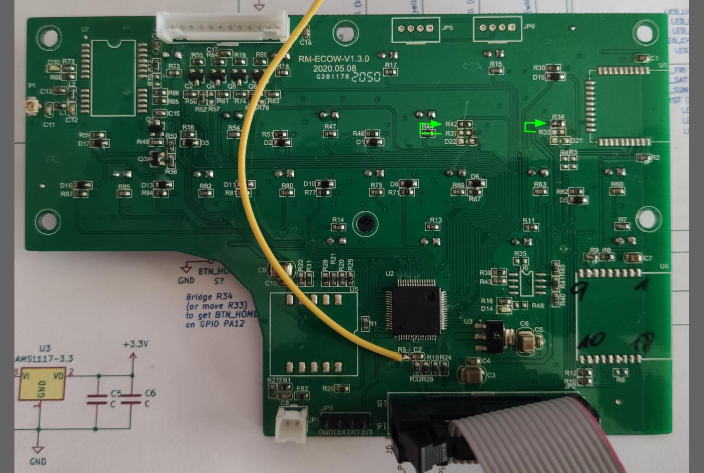
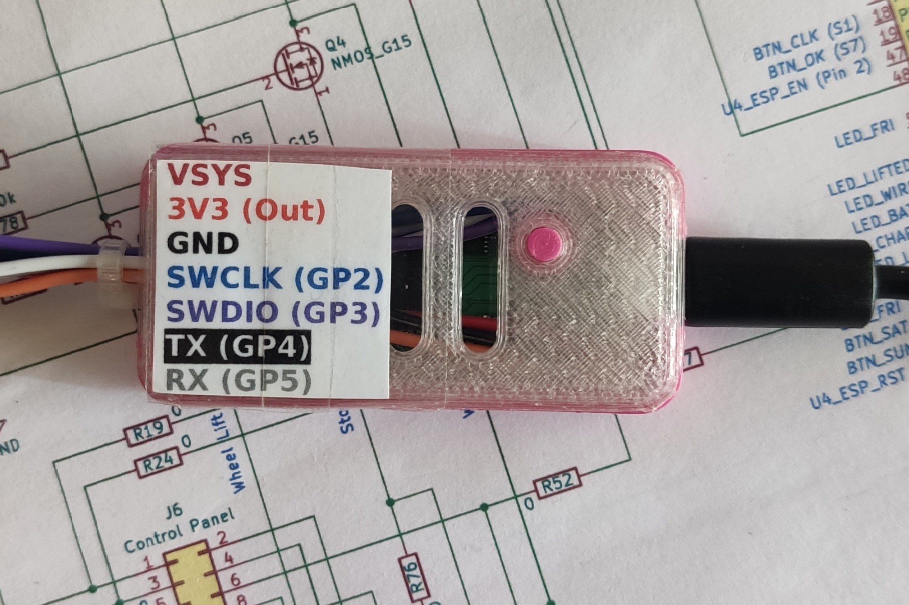
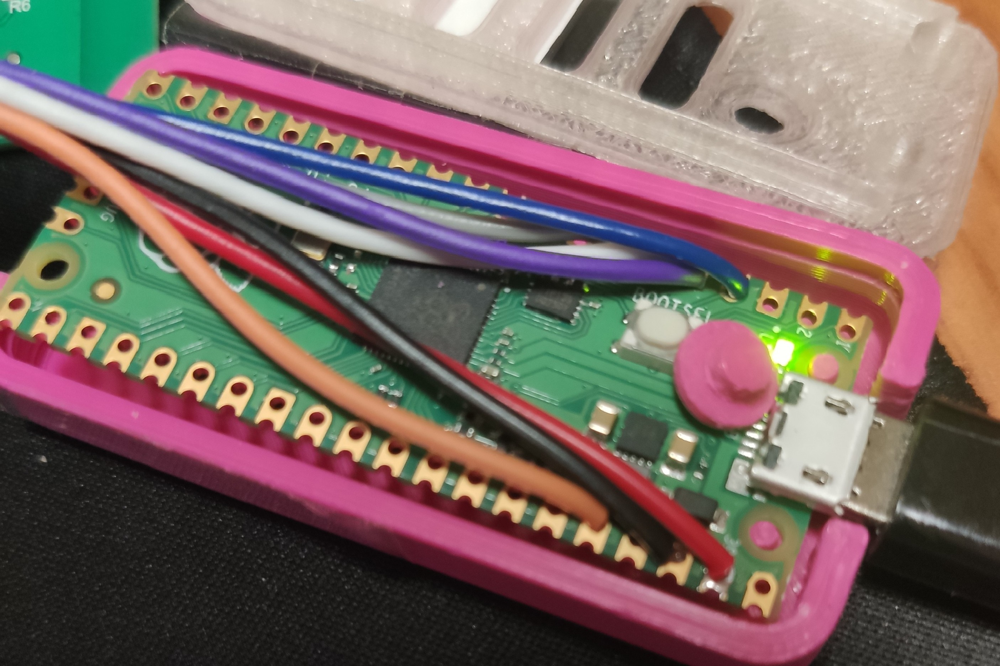

[![Contributors][contributors-shield]][contributors-url]
[![Forks][forks-shield]][forks-url]
[![Stargazers][stars-shield]][stars-url]
[![Issues][issues-shield]][issues-url]
[![MIT License][license-shield]][license-url]

<!-- PROJECT LOGO -->
 

  

  <h3 align="center">OM CoverUI Firmware for Stock YardForce Classic 500 PCB</h3>

  

    Yet only tested with PCB labeled "RM-ECOW-V1.3.0, 2020.05.08" (STM32F030R8 MCU Variant)
  

<!-- TABLE OF CONTENTS -->

  
Table of Contents

  <ol>
    <li>
      <a href="#about-the-project">About The Project</a>
      <ul>
        <li><a href="#built-with">Built With</a></li>
      </ul>
    </li>
    <li>
      <a href="#getting-started">Getting Started</a>
      <ul>
        <li><a href="#prerequisites">Prerequisites</a></li>
        <li><a href="#hardware-modifications">Hardware Modifications</a></li>
        <li><a href="#flash-firmware">Flash Firmware</a></li>
      </ul>
    </li>
    <li><a href="#usage">Usage</a></li>
    <li><a href="#final-work">Final work</a></li>
    <li><a href="#contributing">Contributing</a></li>
    <li><a href="#license">License</a></li>
    <li><a href="#acknowledgments">Acknowledgments</a></li>
  </ol>

<!-- ABOUT THE PROJECT -->
## About The Project

For those, who still have their stock *YardForce Classic 500* Cover-UI/Botton-Board available and want to get it running together with [OpenMower](https://github.com/ClemensElflein/OpenMower), I ported OM's CoverUI FW functionality to it.

(<a href="#readme-top">back to top</a>)

### Built With

* [![PlatformIO][PlatformIO.js]][PlatformIO-url]

(<a href="#readme-top">back to top</a>)

<!-- GETTING STARTED -->
## Getting Started

### Prerequisites

* Stock *YardForce Classic 500* Cover-UI/Button-Board 
  As of writing, only PCB version "RM-ECOW-V1.3.0, 2020.05.08" with an "STM32F030R8" MCU has been tested. 
  Be carefull if you've another PCB version or one with a "GD32??" MCU.
* Soldering Iron or Hot-Air Gun to move two SMD resistor
* ST-Link or Picoprobe programmer/debugger

### Hardware Modifications

With the stock component placement, Button-Home and Buttom-Play get routed to the main (black) 16 pin connector (JP2/J6).
But we need them routed to the MCU.
Luckily the PCB is already prepared for this.

We only need to move the 0 Ohm (bridge) resistors R33 to the non-placed R34 position (Home),
as well as R37 to (NP) R42 (Play).

You might also simply bridge R34 and R42, but I thought it's more save to cut the route to the main 16 pin connector.

BTW: The yellow cable on the picture (to R5/C2) might not harm you. This is the NRST signal which is only required if you bugged the code (like me) during development.

Lastly, you need to solder some kind of connector (pin header or cables) to GND, CLK, DIO and 3V3 (directly beside the main 16 pin connector) for your ST-Link or Picoprobe programmer/debugger.

### Flash Firmware

You either need an ST-Link programmer/debugger like this cheap *ST-Link (V2) clone*:

Or use (build) a [Picoprobe][Picoprobe-url] (CMSIS-DAP debugger):

Simply take a [Raspberry Pico][Pico-url], solder some cables, upload [Picoprobe][Picoprobe-url]
and you're ready.

(For sure, there might be more programmer/debugger options, but with these two variants I got it quickly running)

There're two ways to get the Firmware into the MCU. 
Either by self "compile and upload" via PlatformIO, or by a simple Upload via the ST-Link tool (for the latter you need an ST-Link Probe).

#### PlatformIO

[PlatformIO](https://platformio.org/) is a [Visual Studio Code](https://code.visualstudio.com/) extension. Once installed, do:

- `PlatformIO` (left bar)
- `PIO Home` -> `Open`
- `Open Project` cloned repository branch -> CoverUI/Firmware/CoverUI (contains platformio.ini)
- Wait till tools got loaded (bottom right status info)
- In bottombar click `Switch PlatformIO Project Environment` and choose (whatever programmer/debugger- probe you use) either: `env:yfc500_stlink` or `env:yfc500_picoprobe` 
- Wait till tools got loaded (bottom right status info)
- Finally press `PlatformIO: Upload` (right arrow symbol) in bottombar. After it compiled, linked and uploaded, it should reboot and do a short power-on LED animation.

#### ST-Link

Open your ST-Link tool, then:
 - `Connect` to your ST-Link
 - `Open` CoverUI/Firmware/CoverUI/yfc500/bin/firmware.bin
 - `Flash` (to Address 0x08000000)

When done, re-plug your ST-Link and you should see a quick power-on animation.

(<a href="#readme-top">back to top</a>)

<!-- USAGE EXAMPLES -->
## Usage

Once flashed, the CoverUI should show you a quick LED animation when powered on.

There are also two, (I call it) magic-buttons. If you press:

- OK + Sun Button, you're able to trigger the power-on animation. 
  This is mainly for mounting validation, to ensure that you hit all LED guidance holes.
- OK + Clock Button, will show you a firmware version sequence, which should
  show (as of writing) 200. 
  Fully useless ATM ;-)

(<a href="#readme-top">back to top</a>)

## Final work

Lastly, for connecting you CoverUI, you need a cable to plug it into OM's Mainboard "UI Board" connector.

I simply cropped the 16 pin connector from my original cable and crimped OM's plug.

But before blindly doing it, validate if the cables pin 1 mark, also matches the 16 pin female/male connector!

You're done!

Plug it into `UI Board` connector of your OM mainboard.

Now (if you've a more or less actual LowLevel Firmware in your Mainboard's Pico) Clemens developed it the following clever way:

- Charging LED: Fast blink = empty. Slow blink = approx. 1/2 charged. On = Fully charged.
- Battery: On = Battery empty
- Mon-Sun as 7 digit progressbar for battery charge state (only in undocked state)
- 2hr-8hr as 4 digit progressbar for GPS quality. Blink = uncalibrated 
- Wire: Also indicate a poor GPS. On = < 25%, Blink-fast = < 50%, Blink-slow < 75%, Off >= 75%
- S1: On = ROS is running but idle, Blink-slow = ROS in autonomous mode, Blink-fast = ROS in nirvana?
- S2: >TODO<
- Lifted: Show emergency states. >TODO<

<!-- CONTRIBUTING -->
## Contributing

Contributions are what make the open source community such an amazing place to learn, inspire, and create. Any contributions you make are **greatly appreciated**.

If you have a suggestion that would make this better, please fork the repo and create a pull request. You can also simply open an issue with the tag "enhancement".
Don't forget to give the project a star! Thanks again!

1. Fork the Project
2. Create your Feature Branch (`git checkout -b feature/AmazingFeature`)
3. Commit your Changes (`git commit -m 'Add some AmazingFeature'`)
4. Push to the Branch (`git push origin feature/AmazingFeature`)
5. Open a Pull Request

(<a href="#readme-top">back to top</a>)

<!-- LICENSE -->
## License

Distributed under the MIT License. See `LICENSE.txt` for more information.

(<a href="#readme-top">back to top</a>)

<!-- CONTACT -->
<!-- ## Contact

Apehaenger - joerg@ebeling.ws

Project Link: [https://github.com/your_username/repo_name](https://github.com/your_username/repo_name)

(<a href="#readme-top">back to top</a>)

-->

<!-- ACKNOWLEDGMENTS -->
## Acknowledgments

* [OpenMower](https://github.com/ClemensElflein/OpenMower)
* [YardForce](https://www.yardforce.eu)
* [PlatformIO](https://platformio.org/)
* [STM32F0x0](https://www.st.com/en/microcontrollers-microprocessors/stm32f0x0-value-line.html)
* [Picoprobe](https://github.com/raspberrypi/picoprobe)
* [Picoprobe housing](https://www.printables.com/de/model/217523-raspberry-pi-pico-picoprobe-housing)

(<a href="#readme-top">back to top</a>)

<!-- MARKDOWN LINKS & IMAGES -->
<!-- https://www.markdownguide.org/basic-syntax/#reference-style-links -->
[contributors-shield]: https://img.shields.io/github/contributors/ClemensElflein/CoverUI.svg?style=for-the-badge
[contributors-url]: https://github.com/ClemensElflein/CoverUI/graphs/contributors
[forks-shield]: https://img.shields.io/github/forks/ClemensElflein/CoverUI.svg?style=for-the-badge
[forks-url]: https://github.com/ClemensElflein/CoverUI/network/members
[stars-shield]: https://img.shields.io/github/stars/ClemensElflein/CoverUI.svg?style=for-the-badge
[stars-url]: https://github.com/ClemensElflein/CoverUI/stargazers
[issues-shield]: https://img.shields.io/github/issues/ClemensElflein/CoverUI.svg?style=for-the-badge
[issues-url]: https://github.com/ClemensElflein/CoverUI/issues
[license-shield]: https://img.shields.io/github/license/ClemensElflein/CoverUI.svg?style=for-the-badge
[license-url]: https://github.com/ClemensElflein/CoverUI/blob/master/LICENSE.txt
[PlatformIO.js]: https://img.shields.io/badge/build%20with-PlatformIO-orange?logo=data%3Aimage%2Fsvg%2Bxml%3Bbase64%2CPHN2ZyB3aWR0aD0iMjUwMCIgaGVpZ2h0PSIyNTAwIiB2aWV3Qm94PSIwIDAgMjU2IDI1NiIgeG1sbnM9Imh0dHA6Ly93d3cudzMub3JnLzIwMDAvc3ZnIiBwcmVzZXJ2ZUFzcGVjdFJhdGlvPSJ4TWlkWU1pZCI+PHBhdGggZD0iTTEyOCAwQzkzLjgxIDAgNjEuNjY2IDEzLjMxNCAzNy40OSAzNy40OSAxMy4zMTQgNjEuNjY2IDAgOTMuODEgMCAxMjhjMCAzNC4xOSAxMy4zMTQgNjYuMzM0IDM3LjQ5IDkwLjUxQzYxLjY2NiAyNDIuNjg2IDkzLjgxIDI1NiAxMjggMjU2YzM0LjE5IDAgNjYuMzM0LTEzLjMxNCA5MC41MS0zNy40OUMyNDIuNjg2IDE5NC4zMzQgMjU2IDE2Mi4xOSAyNTYgMTI4YzAtMzQuMTktMTMuMzE0LTY2LjMzNC0zNy40OS05MC41MUMxOTQuMzM0IDEzLjMxNCAxNjIuMTkgMCAxMjggMCIgZmlsbD0iI0ZGN0YwMCIvPjxwYXRoIGQ9Ik0yNDkuMzg2IDEyOGMwIDY3LjA0LTU0LjM0NyAxMjEuMzg2LTEyMS4zODYgMTIxLjM4NkM2MC45NiAyNDkuMzg2IDYuNjEzIDE5NS4wNCA2LjYxMyAxMjggNi42MTMgNjAuOTYgNjAuOTYgNi42MTQgMTI4IDYuNjE0YzY3LjA0IDAgMTIxLjM4NiA1NC4zNDYgMTIxLjM4NiAxMjEuMzg2IiBmaWxsPSIjRkZGIi8+PHBhdGggZD0iTTE2MC44NjkgNzQuMDYybDUuMTQ1LTE4LjUzN2M1LjI2NC0uNDcgOS4zOTItNC44ODYgOS4zOTItMTAuMjczIDAtNS43LTQuNjItMTAuMzItMTAuMzItMTAuMzJzLTEwLjMyIDQuNjItMTAuMzIgMTAuMzJjMCAzLjc1NSAyLjAxMyA3LjAzIDUuMDEgOC44MzdsLTUuMDUgMTguMTk1Yy0xNC40MzctMy42Ny0yNi42MjUtMy4zOS0yNi42MjUtMy4zOWwtMi4yNTggMS4wMXYxNDAuODcybDIuMjU4Ljc1M2MxMy42MTQgMCA3My4xNzctNDEuMTMzIDczLjMyMy04NS4yNyAwLTMxLjYyNC0yMS4wMjMtNDUuODI1LTQwLjU1NS01Mi4xOTd6TTE0Ni41MyAxNjQuOGMtMTEuNjE3LTE4LjU1Ny02LjcwNi02MS43NTEgMjMuNjQzLTY3LjkyNSA4LjMyLTEuMzMzIDE4LjUwOSA0LjEzNCAyMS41MSAxNi4yNzkgNy41ODIgMjUuNzY2LTM3LjAxNSA2MS44NDUtNDUuMTUzIDUxLjY0NnptMTguMjE2LTM5Ljc1MmE5LjM5OSA5LjM5OSAwIDAgMC05LjM5OSA5LjM5OSA5LjM5OSA5LjM5OSAwIDAgMCA5LjQgOS4zOTkgOS4zOTkgOS4zOTkgMCAwIDAgOS4zOTgtOS40IDkuMzk5IDkuMzk5IDAgMCAwLTkuMzk5LTkuMzk4em0yLjgxIDguNjcyYTIuMzc0IDIuMzc0IDAgMSAxIDAtNC43NDkgMi4zNzQgMi4zNzQgMCAwIDEgMCA0Ljc0OXoiIGZpbGw9IiNFNTcyMDAiLz48cGF0aCBkPSJNMTAxLjM3MSA3Mi43MDlsLTUuMDIzLTE4LjkwMWMyLjg3NC0xLjgzMiA0Ljc4Ni01LjA0IDQuNzg2LTguNzAxIDAtNS43LTQuNjItMTAuMzItMTAuMzItMTAuMzItNS42OTkgMC0xMC4zMTkgNC42Mi0xMC4zMTkgMTAuMzIgMCA1LjY4MiA0LjU5MiAxMC4yODkgMTAuMjY3IDEwLjMxN0w5NS44IDc0LjM3OGMtMTkuNjA5IDYuNTEtNDAuODg1IDIwLjc0Mi00MC44ODUgNTEuODguNDM2IDQ1LjAxIDU5LjU3MiA4NS4yNjcgNzMuMTg2IDg1LjI2N1Y2OC44OTJzLTEyLjI1Mi0uMDYyLTI2LjcyOSAzLjgxN3ptMTAuMzk1IDkyLjA5Yy04LjEzOCAxMC4yLTUyLjczNS0yNS44OC00NS4xNTQtNTEuNjQ1IDMuMDAyLTEyLjE0NSAxMy4xOS0xNy42MTIgMjEuNTExLTE2LjI4IDMwLjM1IDYuMTc1IDM1LjI2IDQ5LjM2OSAyMy42NDMgNjcuOTI2em0tMTguODItMzkuNDZhOS4zOTkgOS4zOTkgMCAwIDAtOS4zOTkgOS4zOTggOS4zOTkgOS4zOTkgMCAwIDAgOS40IDkuNCA5LjM5OSA5LjM5OSAwIDAgMCA5LjM5OC05LjQgOS4zOTkgOS4zOTkgMCAwIDAtOS4zOTktOS4zOTl6bS0yLjgxIDguNjcxYTIuMzc0IDIuMzc0IDAgMSAxIDAtNC43NDggMi4zNzQgMi4zNzQgMCAwIDEgMCA0Ljc0OHoiIGZpbGw9IiNGRjdGMDAiLz48L3N2Zz4=
[PlatformIO-url]: https://platformio.org/
[ST-Link]: images/IMG_ST-Link-V2-Clone.jpg "ST-Link (V2) Clone"
[Picoprobe-url]: https://github.com/raspberrypi/picoprobe
[Picoprobe]: images/IMG_Picoprobe.jpg
[Picoprobe-open1]: images/IMG_Picoprobe-open1.jpg
[Picoprobe-open2]: images/IMG_Picoprobe-open2.jpg
[Pico-url]: https://www.raspberrypi.com/products/raspberry-pi-pico/ "Raspberry Pico"
